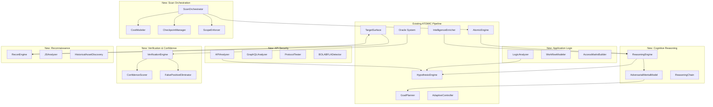

# Technical Design: Advanced Detection Intelligence

## Overview

This design describes the architecture for transforming the ATOMIC Framework from a payload-delivery scanner into a reasoning-driven, verification-hardened vulnerability detection system. The system introduces six major subsystems that integrate with existing infrastructure (hypothesis engine, oracle system, causal correlator, goal planner, adaptive controller, intelligence enricher, and surface pipeline).

The design follows ATOMIC's existing philosophy: findings are counterexamples to claimed security properties, every probe is paired with a falsifying observation, and confidence is earned through statistical verification rather than substring heuristics.

### Design Decisions

1. **Extension over replacement**: New subsystems integrate with existing `Hypothesis`, `Oracle`, `GoalPlanner`, and `AdaptiveController` classes rather than replacing them.
2. **Python dataclass-first**: All data models use `@dataclass` with deterministic `to_dict()` serialization, consistent with `core/models.py`.
3. **LLM-augmented reasoning**: The Reasoning Engine uses the existing LLM router (`core/cloud_llm.py`) for chain-of-thought generation, with rule-based fallback when LLM is unavailable.
4. **Statistical verification**: Confidence scoring builds on the existing oracle system's Mann-Whitney U and Cohen's d infrastructure.
5. **Serializable state**: All scan state is JSON-serializable for checkpointing, using the same patterns as `ScanConfig.to_dict()`.


## Architecture

The system is organized as six subsystems that layer on top of the existing ATOMIC pipeline phases. Each subsystem is a Python module under `core/` with clear interfaces.



### Integration Points

| New Subsystem | Existing Component | Integration Method |
|---|---|---|
| ReasoningEngine | HypothesisEngine | Extends hypothesis generation with reasoning chains |
| ReasoningEngine | GoalPlanner | Feeds hypothesis-derived goals into the goal stack |
| VerificationEngine | Oracle system | Consumes oracle Observations, produces VerificationResults |
| LogicAnalyzer | GoalPlanner | Registers workflow-testing goals |
| APIAnalyzer | HypothesisEngine | Generates protocol-specific hypotheses |
| ReconEngine | TargetSurface | Adds discovered endpoints to surface |
| ScanOrchestrator | AdaptiveController | Uses adaptive signals for rate control |


## Components and Interfaces

### 1. ReasoningEngine (`core/reasoning_engine.py`)

Generates multi-step reasoning chains and manages the adversarial mental model.

```python
class ReasoningEngine:
    def __init__(self, engine: "AtomicEngine", llm_router=None):
        """Initialize with engine context and optional LLM router."""

    def analyze_endpoint(self, endpoint: SurfaceEndpoint, context: "ScanContext") -> ReasoningResult:
        """Generate reasoning chain and hypotheses for an endpoint."""

    def build_mental_model(self, endpoint: SurfaceEndpoint, responses: List[ResponseSample]) -> AdversarialMentalModel:
        """Build/update adversarial mental model from observations."""

    def update_mental_model(self, model: AdversarialMentalModel, observation: Observation) -> AdversarialMentalModel:
        """Update model with new observation, re-evaluate pending attacks."""

    def generate_transfer_hypotheses(self, finding: "Finding", surface: TargetSurface) -> List[Hypothesis]:
        """Generate cross-domain transfer hypotheses from a confirmed finding."""

    def score_creativity(self, candidates: List[Hypothesis]) -> List[Tuple[Hypothesis, float]]:
        """Score each candidate on creativity (0.0-1.0), preferring unexplored paths."""

    def detect_application_context(self, surface: TargetSurface, intel: IntelligenceBundle) -> str:
        """Identify application domain (e-commerce, banking, healthcare, etc.)."""
```

### 2. VerificationEngine (`core/verification_engine.py`)

Multi-signal verification, confidence calibration, and false positive elimination.

```python
class VerificationEngine:
    def __init__(self, engine: "AtomicEngine", oracles: List[Oracle]):
        """Initialize with available oracles."""

    def verify_finding(self, candidate: "Finding", requester) -> VerificationResult:
        """Collect multiple evidence signals and produce verification result."""

    def compute_confidence(self, signals: List[EvidenceSignal]) -> float:
        """Compute calibrated confidence score from weighted signals."""

    def check_reproducibility(self, candidate: "Finding", requester) -> Tuple[bool, float]:
        """Attempt to reproduce finding; return (reproduced, bonus)."""

    def check_false_positive(self, candidate: "Finding") -> Tuple[bool, str]:
        """Check against known false positive patterns; return (is_fp, reason)."""

    def suppress_finding(self, finding: "Finding", reason: str) -> None:
        """Move finding to suppressed collection with reason."""

    def restore_suppressed(self, finding_id: str) -> None:
        """Restore a suppressed finding and update FP pattern database."""
```

### 3. LogicAnalyzer (`core/logic_analyzer.py`)

Business logic vulnerability detection and multi-step transaction testing.

```python
class LogicAnalyzer:
    def __init__(self, engine: "AtomicEngine"):
        """Initialize with engine context."""

    def model_workflow(self, endpoints: List[SurfaceEndpoint], responses: List) -> WorkflowModel:
        """Model expected step sequence from observed request chains."""

    def test_step_skipping(self, workflow: WorkflowModel, requester) -> List["Finding"]:
        """Test for step-skipping vulnerabilities."""

    def build_access_matrix(self, endpoints: List[SurfaceEndpoint], credentials: List) -> AccessMatrix:
        """Build observed permission matrix across roles."""

    def detect_privilege_escalation(self, matrix: AccessMatrix) -> List["Finding"]:
        """Detect unauthorized access patterns in the access matrix."""

    def test_rate_limit_bypass(self, endpoint: SurfaceEndpoint, requester) -> List["Finding"]:
        """Test rate limit bypass techniques."""

    def test_transaction_manipulation(self, workflow: WorkflowModel, requester) -> List["Finding"]:
        """Test parameter manipulation between transaction steps."""

    def test_race_conditions(self, endpoint: SurfaceEndpoint, requester) -> List["Finding"]:
        """Send parallel requests to detect race conditions."""
```


### 4. APIAnalyzer (`core/api_analyzer.py`)

Deep API security testing for GraphQL, gRPC, WebSocket, and REST composition.

```python
class APIAnalyzer:
    def __init__(self, engine: "AtomicEngine"):
        """Initialize with engine context."""

    def analyze_graphql(self, endpoint: SurfaceEndpoint, requester) -> List["Finding"]:
        """Full GraphQL security analysis (introspection, depth, batch, mutations)."""

    def reconstruct_schema(self, endpoint: SurfaceEndpoint, requester) -> Optional[dict]:
        """Attempt schema reconstruction when introspection is disabled."""

    def test_grpc(self, endpoint: SurfaceEndpoint, requester) -> List["Finding"]:
        """Fuzz gRPC protobuf fields with boundary values."""

    def test_websocket(self, endpoint: SurfaceEndpoint, requester) -> List["Finding"]:
        """Test WebSocket authorization, state manipulation, message replay."""

    def test_api_composition(self, endpoints: List[SurfaceEndpoint], requester) -> List["Finding"]:
        """Test multi-API chaining for unauthorized outcomes."""

    def detect_bola(self, endpoints: List[SurfaceEndpoint], credentials: List, requester) -> List["Finding"]:
        """Systematic BOLA detection via identifier substitution."""

    def detect_bfla(self, endpoints: List[SurfaceEndpoint], credentials: List, requester) -> List["Finding"]:
        """Systematic BFLA detection via privilege-level testing."""
```

### 5. ReconEngine (`core/recon_engine.py`)

Advanced reconnaissance with JavaScript analysis and historical asset discovery.

```python
class ReconEngine:
    def __init__(self, engine: "AtomicEngine"):
        """Initialize with engine context."""

    def analyze_javascript(self, js_content: str, source_url: str) -> JSAnalysisResult:
        """Parse JS to extract endpoints, secrets, and route definitions."""

    def crawl_spa(self, base_url: str, requester) -> List[SurfaceEndpoint]:
        """Execute JavaScript to discover SPA dynamic routes."""

    def analyze_source_maps(self, map_url: str, requester) -> Optional[str]:
        """Download and parse source maps for original source recovery."""

    def correlate_subdomains(self, subdomains: List[str]) -> List[SubdomainCorrelation]:
        """Correlate subdomains via shared TLS certs, DNS, and resource refs."""

    def discover_historical_assets(self, domain: str) -> List[str]:
        """Query Certificate Transparency logs for historical endpoints."""

    def map_third_party_integrations(self, surface: TargetSurface) -> List[ThirdPartyIntegration]:
        """Identify OAuth providers, payment processors, analytics services."""

    def detect_dev_artifacts(self, surface: TargetSurface, requester) -> List[DevArtifact]:
        """Detect source maps, debug endpoints, admin panels, docs."""
```

### 6. ScanOrchestrator (`core/scan_orchestrator.py`)

Intelligent scan management with cost modeling, checkpointing, and compliance.

```python
class ScanOrchestrator:
    def __init__(self, engine: "AtomicEngine", scope: EngagementScope):
        """Initialize with engine and engagement scope."""

    def predict_cost(self, module: str, endpoint: SurfaceEndpoint) -> CostModel:
        """Predict HTTP request count for a module against an endpoint."""

    def prioritize_tests(self, candidates: List[TestCandidate]) -> List[TestCandidate]:
        """Order by expected information gain per request."""

    def check_diminishing_returns(self, endpoint: SurfaceEndpoint) -> bool:
        """Return True if finding probability has dropped below 0.05."""

    def create_checkpoint(self) -> ScanCheckpoint:
        """Serialize current scan state for resumption."""

    def resume_from_checkpoint(self, checkpoint: ScanCheckpoint) -> None:
        """Restore scan state from checkpoint, verify target availability."""

    def validate_scope(self, request_url: str, method: str) -> Tuple[bool, str]:
        """Validate request against engagement scope; return (allowed, reason)."""

    def enforce_time_restrictions(self) -> bool:
        """Check if current time is within permitted scanning window."""

    def select_modules(self, tech_stack: TechStack) -> List[str]:
        """Filter modules to only those relevant to detected technology."""

    def log_scope_decision(self, url: str, allowed: bool, reason: str) -> None:
        """Record scope enforcement decision to audit log."""
```


## Data Models

All data models use Python `@dataclass` with deterministic serialization via `to_dict()`, consistent with the existing `core/models.py` patterns.

### Reasoning Models

```python
@dataclass
class ReasoningStep:
    """A single step in a reasoning chain."""
    step_number: int
    content: str           # Natural language reasoning
    evidence: str = ""     # Supporting evidence (header, response pattern, etc.)
    confidence: float = 0.0

@dataclass
class ReasoningChain:
    """Ordered sequence of reasoning steps for an attack decision."""
    chain_id: str
    endpoint_url: str
    steps: List[ReasoningStep]           # Minimum 3 steps
    selected_module: str
    creativity_score: float = 0.0        # 0.0 to 1.0
    application_context: str = ""        # e.g., "e-commerce", "banking"
    timestamp: float = 0.0

@dataclass
class AdversarialMentalModel:
    """Internal representation of target's inferred security posture."""
    model_id: str
    target_domain: str
    tech_stack: Dict[str, str]           # technology → category
    security_headers: Dict[str, str]     # header → value
    response_patterns: List[str]         # Observed behavioral patterns
    inferred_defenses: List[str]         # WAF, rate-limiting, CSRF tokens, etc.
    confirmed_hypotheses: List[str]      # hypothesis_ids confirmed
    denied_hypotheses: List[str]         # hypothesis_ids denied
    domain_context: str = ""             # Application domain
    last_updated: float = 0.0

    def to_dict(self) -> dict:
        return {
            "confirmed_hypotheses": sorted(self.confirmed_hypotheses),
            "denied_hypotheses": sorted(self.denied_hypotheses),
            "domain_context": self.domain_context,
            "inferred_defenses": sorted(self.inferred_defenses),
            "last_updated": self.last_updated,
            "model_id": self.model_id,
            "response_patterns": self.response_patterns,
            "security_headers": dict(sorted(self.security_headers.items())),
            "target_domain": self.target_domain,
            "tech_stack": dict(sorted(self.tech_stack.items())),
        }
```

### Verification Models

```python
@dataclass
class EvidenceSignal:
    """An independent observable indicator confirming a finding."""
    signal_id: str
    category: str          # "timing", "content", "error", "status_code", "behavior_change"
    description: str
    quality: str           # "definitive" or "circumstantial"
    weight: float          # 1.0 for definitive, 0.3-0.6 for circumstantial
    raw_data: str = ""     # Concrete evidence (timing values, error text, etc.)

@dataclass
class VerificationResult:
    """Outcome of multi-signal verification."""
    finding_id: str
    signals: List[EvidenceSignal]
    confidence_score: float              # 0.0 to 1.0, calibrated
    status: str                          # "confirmed", "unconfirmed", "transient", "suppressed"
    reproducible: bool = False
    reproducibility_bonus: float = 0.0
    suppression_reason: str = ""
    verification_timestamp: float = 0.0

    def to_dict(self) -> dict:
        return {
            "confidence_score": round(self.confidence_score, 4),
            "finding_id": self.finding_id,
            "reproducibility_bonus": round(self.reproducibility_bonus, 4),
            "reproducible": self.reproducible,
            "signals": [{"category": s.category, "quality": s.quality, "weight": s.weight} for s in self.signals],
            "status": self.status,
            "suppression_reason": self.suppression_reason,
        }
```


### Logic Analysis Models

```python
@dataclass
class WorkflowStep:
    """A single step in a multi-step workflow."""
    step_number: int
    url: str
    method: str
    description: str
    required_params: List[str]
    expected_status: int = 200
    prerequisite_steps: List[int] = field(default_factory=list)

@dataclass
class WorkflowModel:
    """Representation of expected application behavior sequences."""
    workflow_id: str
    name: str                            # e.g., "checkout", "registration"
    steps: List[WorkflowStep]
    entry_point: str                     # URL of first step
    completion_indicator: str            # Response pattern indicating completion

@dataclass
class AccessMatrixEntry:
    """A single cell in the access matrix."""
    role: str
    resource: str
    method: str
    allowed_expected: bool               # What's expected
    allowed_observed: bool               # What was observed
    evidence_url: str = ""
    status_code: int = 0

@dataclass
class AccessMatrix:
    """Mapping of roles to resources with observed vs expected permissions."""
    matrix_id: str
    roles: List[str]
    resources: List[str]
    entries: List[AccessMatrixEntry]
    escalation_findings: List[str] = field(default_factory=list)  # finding_ids

    def to_dict(self) -> dict:
        return {
            "entries": [{"method": e.method, "observed": e.allowed_observed,
                         "expected": e.allowed_expected, "resource": e.resource,
                         "role": e.role} for e in self.entries],
            "escalation_findings": sorted(self.escalation_findings),
            "matrix_id": self.matrix_id,
            "resources": sorted(self.resources),
            "roles": sorted(self.roles),
        }
```

### Orchestration Models

```python
@dataclass
class CostModel:
    """Prediction of HTTP request count for a test module."""
    module: str
    endpoint_url: str
    predicted_requests: int
    information_gain: float              # Expected info gain (0.0-1.0)
    cost_per_info: float = 0.0           # requests / info_gain

    def __post_init__(self):
        if self.information_gain > 0:
            self.cost_per_info = self.predicted_requests / self.information_gain

@dataclass
class ScanCheckpoint:
    """Serializable snapshot of scan progress."""
    checkpoint_id: str
    timestamp: float
    completed_tests: List[str]           # List of (module, endpoint) keys
    pending_queue: List[str]             # Serialized pending test candidates
    findings_snapshot: List[dict]        # Serialized findings
    mental_model_state: dict             # Serialized AdversarialMentalModel
    goal_stack_state: List[dict]         # Serialized goals
    total_requests_used: int = 0
    scan_config: dict = field(default_factory=dict)

    def to_dict(self) -> dict:
        return {
            "checkpoint_id": self.checkpoint_id,
            "completed_tests": self.completed_tests,
            "findings_count": len(self.findings_snapshot),
            "pending_count": len(self.pending_queue),
            "timestamp": self.timestamp,
            "total_requests_used": self.total_requests_used,
        }

@dataclass
class EngagementScope:
    """Defined boundaries for authorized testing."""
    allowed_domains: List[str]
    allowed_paths: List[str]             # Regex patterns
    excluded_paths: List[str]            # Regex patterns
    allowed_methods: List[str]           # HTTP methods permitted
    time_restrictions: Optional[Dict[str, str]] = None  # {"start": "09:00", "end": "17:00"}
    max_requests_per_minute: int = 0     # 0 = unlimited

    def to_dict(self) -> dict:
        return {
            "allowed_domains": sorted(self.allowed_domains),
            "allowed_methods": sorted(self.allowed_methods),
            "allowed_paths": self.allowed_paths,
            "excluded_paths": self.excluded_paths,
            "max_requests_per_minute": self.max_requests_per_minute,
            "time_restrictions": self.time_restrictions,
        }
```

### Reconnaissance Models

```python
@dataclass
class JSAnalysisResult:
    """Results from JavaScript static analysis."""
    source_url: str
    discovered_endpoints: List[str]
    discovered_secrets: List[Dict[str, str]]  # {"type": "api_key", "value": "...", "context": "..."}
    route_definitions: List[str]
    source_map_urls: List[str]

@dataclass
class SubdomainCorrelation:
    """Correlation between subdomains via shared indicators."""
    subdomain: str
    correlation_type: str                # "tls_cert", "dns_record", "resource_ref"
    shared_indicator: str                # The shared cert CN, DNS record, etc.
    confidence: float = 0.0

@dataclass
class DevArtifact:
    """A discovered development artifact."""
    url: str
    artifact_type: str                   # "source_map", "debug_endpoint", "admin_panel", "docs"
    priority_boost: float = 0.5          # How much to boost scan priority
    details: str = ""
```


## Correctness Properties

*A property is a characteristic or behavior that should hold true across all valid executions of a system — essentially, a formal statement about what the system should do. Properties serve as the bridge between human-readable specifications and machine-verifiable correctness guarantees.*

### Property 1: Reasoning chain minimum length

*For any* SurfaceEndpoint and ScanContext provided to the ReasoningEngine, the produced ReasoningChain SHALL contain at least three ReasoningSteps.

**Validates: Requirements 1.1**

### Property 2: Adversarial mental model completeness

*For any* endpoint with non-empty HTTP headers and response data, the AdversarialMentalModel produced by build_mental_model SHALL contain non-empty tech_stack, security_headers, and response_patterns fields corresponding to the input signals.

**Validates: Requirements 1.2**

### Property 3: Creativity score range invariant

*For any* list of candidate Hypotheses provided to score_creativity, all returned creativity scores SHALL be within the range [0.0, 1.0] inclusive.

**Validates: Requirements 1.5**

### Property 4: Hypothesis generation guarantee

*For any* SurfaceEndpoint analyzed by the ReasoningEngine, at least one falsifiable Hypothesis SHALL be generated.

**Validates: Requirements 2.1**

### Property 5: Mental model update on hypothesis resolution

*For any* Hypothesis that receives an Observation (positive or negative), the AdversarialMentalModel SHALL contain the hypothesis_id in either its confirmed_hypotheses list (if positive) or denied_hypotheses list (if negative), and never in both.

**Validates: Requirements 2.3**

### Property 6: Denied hypothesis non-repetition

*For any* Hypothesis that has been denied for a given endpoint, subsequent hypothesis generation for that same endpoint and defense mechanism SHALL NOT produce a hypothesis of the same attack_class targeting the same defense.

**Validates: Requirements 2.5**

### Property 7: Transfer and derivative hypothesis generation

*For any* confirmed finding on a surface with multiple related endpoints, the ReasoningEngine SHALL generate at least one transfer/derivative hypothesis targeting a different endpoint.

**Validates: Requirements 1.4, 2.4**


### Property 8: Confidence classification by signal count

*For any* VerificationResult, if exactly one EvidenceSignal is present then status SHALL be "unconfirmed" and confidence_score SHALL be below 0.5; if two or more independent EvidenceSignals from different categories confirm the finding then status SHALL be "confirmed" and confidence_score SHALL be above 0.7.

**Validates: Requirements 3.3, 3.4**

### Property 9: Confidence score range invariant

*For any* finding processed by the VerificationEngine, the resulting confidence_score SHALL be within [0.0, 1.0] inclusive.

**Validates: Requirements 4.1**

### Property 10: Evidence quality classification

*For any* EvidenceSignal, if it represents a successful payload extraction or observable state change then quality SHALL be "definitive" with weight 1.0; if it represents only timing differences or error patterns then quality SHALL be "circumstantial" with weight in [0.3, 0.6].

**Validates: Requirements 4.3, 4.4**

### Property 11: Definitive evidence produces higher confidence than circumstantial

*For any* finding, a VerificationResult produced with definitive EvidenceSignals SHALL have a higher confidence_score than the same finding verified with only circumstantial EvidenceSignals.

**Validates: Requirements 4.2**

### Property 12: Reproducibility bonus

*For any* finding that is successfully reproduced on retry, the VerificationResult SHALL include a reproducibility_bonus of at least 0.1.

**Validates: Requirements 4.5**

### Property 13: Non-reproducible finding degradation

*For any* finding that fails reproduction on retry, the VerificationResult SHALL have status "transient" and confidence_score reduced by at least 0.3 compared to the pre-reproduction score.

**Validates: Requirements 3.5**

### Property 14: False positive suppression routing

*For any* finding that either matches a known false positive pattern with similarity above 0.8 OR has confidence_score below 0.3 after verification, the finding SHALL be moved to the suppressed collection with a non-empty suppression_reason.

**Validates: Requirements 5.2, 5.5**

### Property 15: Suppressed finding retention

*For any* finding that is suppressed, it SHALL remain accessible in the suppressed collection (never deleted).

**Validates: Requirements 5.3**


### Property 16: Access matrix completeness

*For any* set of roles and resource endpoints provided to build_access_matrix, the resulting AccessMatrix SHALL contain an entry for every (role, resource, method) combination — i.e., the matrix is complete with no missing cells.

**Validates: Requirements 6.4**

### Property 17: Privilege escalation detection

*For any* AccessMatrix where a lower-privilege role has allowed_observed=True for a resource where allowed_expected=False, the LogicAnalyzer SHALL report a privilege escalation finding referencing that specific role and resource.

**Validates: Requirements 6.5**

### Property 18: Step-skipping test coverage

*For any* WorkflowModel with N steps (N > 2), the LogicAnalyzer SHALL attempt to reach each step i (where i > 1) without completing at least one prerequisite step.

**Validates: Requirements 6.2, 6.3**

### Property 19: Rate limit bypass technique count

*For any* rate-limited endpoint tested by the LogicAnalyzer, at least three distinct bypass techniques SHALL be attempted.

**Validates: Requirements 6.6**

### Property 20: GraphQL depth testing monotonicity

*For any* GraphQL endpoint analyzed by the APIAnalyzer, the sequence of depth-test queries SHALL have strictly increasing depth values.

**Validates: Requirements 8.3**

### Property 21: GraphQL mutation mass assignment coverage

*For any* GraphQL schema with mutations, each mutation SHALL be tested with at least one undocumented field included in the input.

**Validates: Requirements 8.5**

### Property 22: BOLA identifier substitution

*For any* resource endpoint with identifiers and at least two authenticated contexts, the APIAnalyzer SHALL test identifier substitution from one context into requests from the other context.

**Validates: Requirements 10.1**

### Property 23: Authorization test privilege level minimum

*For any* authorization test performed by the APIAnalyzer, at least two different privilege levels SHALL be used.

**Validates: Requirements 10.4**

### Property 24: BOLA/BFLA finding completeness

*For any* BOLA or BFLA finding reported by the APIAnalyzer, the finding SHALL contain the specific resource identifier, the attempted action, and both privilege contexts involved.

**Validates: Requirements 10.3**


### Property 25: JavaScript endpoint extraction

*For any* JavaScript content containing URL-like strings matching the pattern `/api/...` or route definitions, the ReconEngine SHALL extract all such patterns into the discovered_endpoints list.

**Validates: Requirements 11.1**

### Property 26: JavaScript secret detection

*For any* JavaScript content containing strings matching known secret formats (API keys, tokens, credentials), the ReconEngine SHALL detect and report all matching patterns.

**Validates: Requirements 11.2**

### Property 27: Discovered endpoint metadata

*For any* endpoint extracted from JavaScript analysis, when added to the scan queue it SHALL include metadata with discovery_source set to "javascript".

**Validates: Requirements 11.4**

### Property 28: Development artifact priority boost

*For any* development artifact detected by the ReconEngine, its assigned scan priority SHALL be elevated above the default baseline priority.

**Validates: Requirements 12.5**

### Property 29: Cost model production

*For any* (module, endpoint) pair provided to the ScanOrchestrator, predict_cost SHALL return a CostModel with predicted_requests > 0 and information_gain in [0.0, 1.0].

**Validates: Requirements 13.1**

### Property 30: Test prioritization ordering

*For any* list of TestCandidates passed to prioritize_tests, the returned list SHALL be sorted in descending order by information_gain / predicted_requests (highest value first).

**Validates: Requirements 13.2**

### Property 31: Diminishing returns threshold

*For any* endpoint where finding probability has dropped below 0.05, check_diminishing_returns SHALL return True.

**Validates: Requirements 13.3**

### Property 32: Performance degradation rate reduction

*For any* target exhibiting response times exceeding 3x baseline, the ScanOrchestrator SHALL reduce the request rate by at least 50% compared to the pre-degradation rate.

**Validates: Requirements 13.4**

### Property 33: Checkpoint round-trip consistency

*For any* scan state, creating a ScanCheckpoint and then resuming from it SHALL restore the same pending queue (minus completed tests) and SHALL NOT re-run any previously completed tests.

**Validates: Requirements 14.1, 14.2**

### Property 34: Checkpoint interval guarantee

*For any* scan session, ScanCheckpoints SHALL be created at intervals no greater than every 50 completed tests or every 5 minutes of elapsed time, whichever comes first.

**Validates: Requirements 14.4**


### Property 35: Module selection technology relevance

*For any* technology stack provided to select_modules, the returned module list SHALL be a non-empty subset of all available modules, containing only modules relevant to the detected technologies.

**Validates: Requirements 15.1**

### Property 36: Module list monotonicity on tech discovery

*For any* existing module selection, when new technology indicators are discovered mid-scan, the active module set SHALL grow or remain the same (never shrink).

**Validates: Requirements 15.4**

### Property 37: Scope validation correctness

*For any* request URL and EngagementScope, validate_scope SHALL return (True, reason) if the URL matches allowed domains and paths and does not match excluded paths, and (False, reason) otherwise — with reason always non-empty.

**Validates: Requirements 16.1, 16.2**

### Property 38: Scope audit log completeness

*For any* scope enforcement decision (allow or block), the audit log SHALL contain an entry with a timestamp, source module identifier, target URL, and the decision outcome.

**Validates: Requirements 16.4**

### Property 39: Time restriction enforcement

*For any* EngagementScope with time_restrictions and a current time outside the permitted window, enforce_time_restrictions SHALL return False (pause scanning); for times within the window it SHALL return True.

**Validates: Requirements 16.5**


## Error Handling

### General Error Strategy

The system follows ATOMIC's existing philosophy of graceful degradation: subsystem failures do not crash the scan but are logged and the scan continues with reduced capability.

### Per-Subsystem Error Handling

| Subsystem | Failure Mode | Recovery Strategy |
|---|---|---|
| ReasoningEngine | LLM unavailable or timeout | Fall back to rule-based reasoning (existing `FALLBACK_RULES` in `attack_planner.py`) |
| ReasoningEngine | Malformed LLM output | Log error, skip reasoning chain, proceed with default hypothesis templates |
| VerificationEngine | Oracle raises exception | Skip that oracle, use remaining signals for confidence computation |
| VerificationEngine | Target unresponsive during reproduction | Mark finding as "unconfirmed" (cannot confirm or deny) |
| LogicAnalyzer | Workflow modeling fails (ambiguous step order) | Log warning, skip workflow testing for that endpoint set |
| LogicAnalyzer | Race condition test timeout | Report test as inconclusive, do not generate false findings |
| APIAnalyzer | GraphQL introspection blocked | Attempt schema reconstruction; if that also fails, skip field-level auth tests |
| APIAnalyzer | WebSocket connection refused | Log skip, mark endpoint as "connection_refused", continue with other endpoints |
| ReconEngine | JavaScript parsing error (malformed JS) | Log error with source URL, skip that file, continue with remaining JS files |
| ReconEngine | Source map download fails (404, timeout) | Log warning, continue without reconstructed source |
| ScanOrchestrator | Checkpoint serialization fails | Log error, retry once; if still failing, continue scan without checkpointing |
| ScanOrchestrator | Checkpoint resumption fails (corrupt file) | Log error, offer fresh scan start, do not partially resume |
| ScanOrchestrator | Scope validation regex error | Fail closed (block request), log the regex error for operator review |

### Error Escalation Rules

1. **Single subsystem failure**: Log at WARNING level, continue scan with degraded capability
2. **Multiple subsystem failures (3+ in 1 minute)**: Log at ERROR level, pause scan, notify operator
3. **Scope enforcement failure**: Always fail closed (block), never fail open
4. **Data corruption detected**: Halt affected subsystem, create emergency checkpoint, alert operator

### LLM Error Handling

Since the ReasoningEngine depends on LLM availability:

- **Timeout**: 30-second timeout per LLM call; on timeout, use cached reasoning if available or fall back to rule-based selection
- **Rate limiting**: Exponential backoff (1s, 2s, 4s, 8s max) before falling back to rules
- **Invalid response**: Validate LLM output structure; if missing required fields, discard and use fallback
- **Context overflow**: Truncate oldest context entries first; maintain most recent observations


## Testing Strategy

### Dual Testing Approach

The testing strategy combines property-based tests (for universal correctness guarantees) with example-based unit tests (for specific scenarios, edge cases, and integration points).

### Property-Based Testing

**Library**: [Hypothesis](https://hypothesis.readthedocs.io/) (Python PBT library)

**Configuration**:
- Minimum 100 iterations per property test (`@settings(max_examples=100)`)
- Each property test references its design property number
- Tag format: `# Feature: advanced-detection-intelligence, Property N: <property_text>`

**Property Test Scope** (mapped from Correctness Properties above):

| Property | Component Under Test | What Varies |
|---|---|---|
| 1 | ReasoningEngine.analyze_endpoint | Endpoint URLs, tech stacks, response patterns |
| 2 | ReasoningEngine.build_mental_model | Headers, cookies, response bodies |
| 3 | ReasoningEngine.score_creativity | Hypothesis lists of varying size/type |
| 4 | ReasoningEngine.analyze_endpoint | All endpoint shapes |
| 5 | ReasoningEngine.update_mental_model | Positive/negative observations |
| 6 | ReasoningEngine (stateful) | Denied hypothesis types, repeat queries |
| 7 | ReasoningEngine.generate_transfer_hypotheses | Findings on surfaces with 2+ endpoints |
| 8 | VerificationEngine.verify_finding | Signal count (1 vs 2+), signal categories |
| 9 | VerificationEngine.compute_confidence | All signal combinations |
| 10 | EvidenceSignal classification | Signal types (payload, timing, error) |
| 11 | VerificationEngine.compute_confidence | Definitive vs circumstantial signals |
| 12-13 | VerificationEngine.check_reproducibility | Reproducible vs non-reproducible findings |
| 14-15 | VerificationEngine.suppress_finding | Findings near FP patterns, low-confidence findings |
| 16 | LogicAnalyzer.build_access_matrix | Role/resource sets of varying size |
| 17 | LogicAnalyzer.detect_privilege_escalation | Matrices with/without escalation patterns |
| 18-19 | LogicAnalyzer.test_step_skipping | Workflows of varying length |
| 20-21 | APIAnalyzer.analyze_graphql | GraphQL schemas of varying depth/mutation count |
| 22-24 | APIAnalyzer.detect_bola/detect_bfla | Resource endpoints, credential sets |
| 25-27 | ReconEngine.analyze_javascript | JS content with embedded URLs/secrets |
| 28 | ReconEngine.detect_dev_artifacts | Response sets with artifact patterns |
| 29-32 | ScanOrchestrator (cost/priority) | Module/endpoint pairs, performance metrics |
| 33-34 | ScanOrchestrator (checkpointing) | Scan states of varying size |
| 35-36 | ScanOrchestrator.select_modules | Tech stacks, mid-scan discoveries |
| 37-39 | ScanOrchestrator (scope) | URLs, scope definitions, time windows |

### Unit Testing (Example-Based)

Unit tests cover:
- Specific known vulnerability patterns (e.g., GraphQL introspection detection)
- Edge cases: empty inputs, malformed data, boundary values
- Integration points between subsystems
- Error handling paths (LLM timeout, network failure, corrupt checkpoint)
- Specific workflow scenarios (checkout step-skipping, BOLA on known API patterns)

### Integration Testing

Integration tests cover external dependencies and multi-component interactions:
- LLM integration (with mock LLM backend)
- WebSocket connection handling
- SPA crawling with headless browser
- Historical asset discovery via CT logs (with mock API)
- Full scan lifecycle with checkpointing and resumption

### Test Organization

```
tests/
├── property/
│   ├── test_reasoning_engine_props.py
│   ├── test_verification_engine_props.py
│   ├── test_logic_analyzer_props.py
│   ├── test_api_analyzer_props.py
│   ├── test_recon_engine_props.py
│   └── test_scan_orchestrator_props.py
├── unit/
│   ├── test_reasoning_engine.py
│   ├── test_verification_engine.py
│   ├── test_logic_analyzer.py
│   ├── test_api_analyzer.py
│   ├── test_recon_engine.py
│   └── test_scan_orchestrator.py
└── integration/
    ├── test_full_scan_lifecycle.py
    ├── test_checkpoint_resumption.py
    └── test_scope_enforcement.py
```

