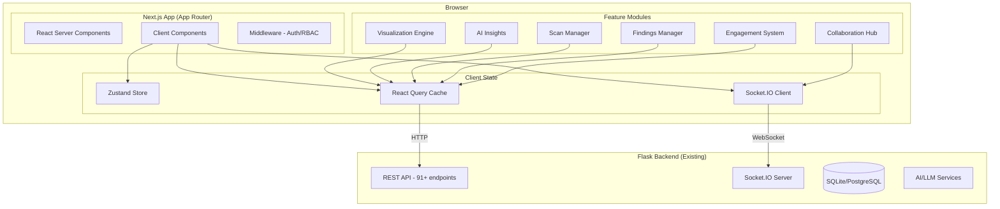
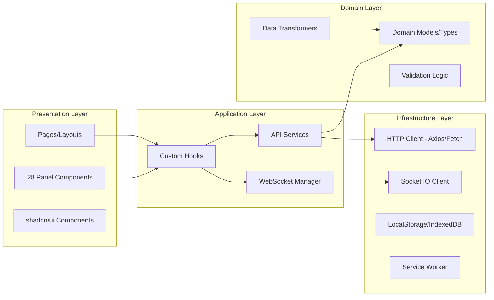

# Technical Design Document: Modern Web Dashboard

## Overview

This document describes the technical design for a complete rewrite of the Atomic Framework vulnerability scanner web dashboard. The existing Flask + vanilla JavaScript frontend (28 panels, 91+ API endpoints) will be replaced by a modern React/Next.js 14+ application with TypeScript, providing real-time collaboration, AI-powered insights, advanced visualizations, and enterprise engagement management.

The existing Flask backend remains as the API layer. This design covers only the new frontend application.

### Key Design Decisions

| Decision | Choice | Rationale |
|----------|--------|-----------|
| Framework | Next.js 14+ (App Router) | Server components, code splitting, file-based routing |
| Language | TypeScript (strict) | Type safety across 91+ API endpoints |
| UI Library | shadcn/ui + Radix UI + Tailwind | Accessible, themeable, composable components |
| State (client) | Zustand | Lightweight, no boilerplate, middleware for persistence |
| State (server) | TanStack Query (React Query) | Caching, background refetch, optimistic updates |
| Real-time | Socket.IO client | Matches existing Flask-SocketIO backend |
| Visualization | D3.js + Cytoscape.js | D3 for charts/heatmaps, Cytoscape for graph layouts |
| Testing | Vitest + React Testing Library + Playwright | Unit + integration + E2E coverage |
| PBT | fast-check | Property-based testing for TypeScript |

## Architecture

### High-Level Architecture



### Application Layer Architecture



### Directory Structure

```
dashboard/
├── app/                          # Next.js App Router
│   ├── (auth)/                   # Auth route group
│   │   ├── login/page.tsx
│   │   └── layout.tsx
│   ├── (dashboard)/              # Dashboard route group
│   │   ├── layout.tsx            # Sidebar + header layout
│   │   ├── page.tsx              # Main dashboard overview
│   │   ├── scans/
│   │   │   ├── page.tsx          # Scan list
│   │   │   ├── [id]/page.tsx     # Scan detail
│   │   │   └── new/page.tsx      # Scan wizard
│   │   ├── findings/
│   │   │   ├── page.tsx          # Findings list/Kanban
│   │   │   └── [id]/page.tsx     # Finding detail
│   │   ├── attack-map/page.tsx
│   │   ├── kill-chain/page.tsx
│   │   ├── heatmap/page.tsx
│   │   ├── topology/page.tsx
│   │   ├── insights/page.tsx
│   │   ├── engagements/
│   │   │   ├── page.tsx
│   │   │   └── [id]/page.tsx
│   │   └── [...panel]/page.tsx   # Catch-all for remaining panels
│   ├── api/                      # API routes (proxy/BFF)
│   ├── layout.tsx                # Root layout
│   └── globals.css
├── components/
│   ├── ui/                       # shadcn/ui components
│   ├── panels/                   # 28 panel components (lazy loaded)
│   ├── visualizations/           # D3/Cytoscape components
│   ├── collaboration/            # Presence, cursors, chat
│   ├── command-palette/          # Command palette
│   └── shared/                   # Shared layout components
├── hooks/                        # Custom React hooks
│   ├── use-websocket.ts
│   ├── use-scan.ts
│   ├── use-findings.ts
│   ├── use-collaboration.ts
│   └── use-engagement.ts
├── lib/
│   ├── api/                      # API client and service functions
│   ├── websocket/                # Socket.IO manager + message queue
│   ├── store/                    # Zustand stores
│   ├── validators/               # Input validation (Zod schemas)
│   ├── transforms/               # Data transformation utilities
│   └── utils/                    # General utilities
├── types/                        # Generated + manual TypeScript types
│   ├── generated/                # Auto-generated from OpenAPI
│   └── index.ts
├── public/
│   ├── manifest.json             # PWA manifest
│   └── sw.js                     # Service worker
├── tests/
│   ├── unit/                     # Vitest unit tests
│   ├── property/                 # fast-check property tests
│   └── e2e/                      # Playwright E2E tests
├── .storybook/                   # Storybook configuration
├── next.config.ts
├── tailwind.config.ts
├── tsconfig.json
├── vitest.config.ts
├── playwright.config.ts
└── Dockerfile
```

## Components and Interfaces

### Core Components

#### 1. WebSocket Manager

Manages Socket.IO connection lifecycle with message queuing during disconnection.

```typescript
interface WebSocketManager {
  connect(engagementId: string): void;
  disconnect(): void;
  send(event: string, payload: unknown): void;
  subscribe(event: string, handler: EventHandler): Unsubscribe;
  getConnectionStatus(): ConnectionStatus;
  getQueuedMessages(): QueuedMessage[];
}

interface QueuedMessage {
  id: string;
  event: string;
  payload: unknown;
  timestamp: number;
}

type ConnectionStatus = 'connected' | 'disconnected' | 'reconnecting';
```

#### 2. State Management (Zustand Stores)

```typescript
// User preferences store (persisted to localStorage)
interface PreferencesStore {
  theme: 'dark' | 'light' | 'quantum';
  sidebarCollapsed: boolean;
  shortcuts: Record<string, string>;
  recentCommands: string[];
  setTheme(theme: PreferencesStore['theme']): void;
  setShortcut(action: string, key: string): void;
}

// Collaboration store (transient)
interface CollaborationStore {
  connectedUsers: PresenceUser[];
  cursors: Record<string, CursorPosition>;
  activityFeed: ActivityEvent[];
  addUser(user: PresenceUser): void;
  removeUser(userId: string): void;
  updateCursor(userId: string, position: CursorPosition): void;
}

// Scan store (transient, UI state)
interface ScanStore {
  activeScanIds: string[];
  scanProgress: Record<string, ScanProgress>;
  updateProgress(scanId: string, progress: ScanProgress): void;
}
```

#### 3. Visualization Engine Components

```typescript
interface AttackGraphProps {
  findings: Finding[];
  exploitPaths: ExploitPath[];
  onNodeClick: (finding: Finding) => void;
  onPathAnimate: (path: ExploitPath) => void;
}

interface KillChainProps {
  findings: Finding[];
  mitreMapping: Record<string, MitrePhase>;
}

interface HeatmapProps {
  findings: Finding[];
  endpoints: string[];
  vulnTypes: string[];
}

interface NetworkTopologyProps {
  hosts: Host[];
  services: Service[];
  connections: NetworkConnection[];
}
```

#### 4. Scan Wizard

```typescript
interface ScanWizardStep {
  id: string;
  title: string;
  component: React.ComponentType<StepProps>;
  validate: (data: Partial<ScanConfig>) => ValidationResult;
}

interface ScanConfig {
  targets: Target[];
  modules: ModuleSelection[];
  auth: AuthConfig | null;
  options: ScanOptions;
  template?: string;
}

interface ScanTemplate {
  id: string;
  name: string;
  description: string;
  config: ScanConfig;
  createdAt: string;
  updatedAt: string;
}
```

#### 5. Findings Manager

```typescript
interface FindingsKanbanState {
  columns: KanbanColumn[];
  moveCard(findingId: string, fromColumn: string, toColumn: string): void;
}

interface KanbanColumn {
  id: FindingStatus;
  title: string;
  findings: Finding[];
}

type FindingStatus = 'new' | 'investigating' | 'confirmed' | 'fixed' | 'verified';

interface FindingCluster {
  vulnType: string;
  findings: Finding[];
  endpoints: string[];
  count: number;
}

interface ExportPayload {
  tracker: 'jira' | 'github' | 'linear';
  fields: Record<string, string>;
}
```

#### 6. Engagement System

```typescript
type EngagementState = 'create' | 'configure' | 'execute' | 'report' | 'close';

interface EngagementTransition {
  from: EngagementState;
  to: EngagementState;
  valid: boolean;
}

const VALID_TRANSITIONS: Record<EngagementState, EngagementState[]> = {
  create: ['configure'],
  configure: ['execute'],
  execute: ['report'],
  report: ['close', 'execute'], // can go back for retesting
  close: [],
};

interface Engagement {
  id: string;
  state: EngagementState;
  clientId: string;
  scope: ScopeDefinition[];
  timeEntries: TimeEntry[];
  deliverables: Deliverable[];
  quotedHours: number;
  actualHours: number;
}

interface ScopeDefinition {
  type: 'domain' | 'path' | 'method';
  pattern: string; // supports regex and wildcards
  isRegex: boolean;
}

interface TimeEntry {
  phase: EngagementState;
  hours: number;
  date: string;
  description: string;
}
```

#### 7. Command Palette

```typescript
interface Command {
  id: string;
  label: string;
  category: string;
  shortcut?: string;
  action: () => void;
  keywords: string[];
}

interface FuzzySearchResult {
  command: Command;
  score: number;
  matchedIndices: number[];
}

function fuzzySearch(query: string, commands: Command[]): FuzzySearchResult[];
```

#### 8. Type Generator

```typescript
interface TypeGeneratorConfig {
  openApiSchemaUrl: string;
  outputDir: string;
  prettier: boolean;
}

// Generates types like:
interface ApiEndpoint {
  method: 'GET' | 'POST' | 'PUT' | 'DELETE';
  path: string;
  requestBody?: TypeReference;
  responseBody: TypeReference;
  queryParams?: TypeReference;
}
```

### Key Utility Functions

```typescript
// Severity to color mapping
function severityToColor(severity: Severity): string;

// MITRE ATT&CK phase mapping
function findingToMitrePhase(finding: Finding): MitrePhase;

// Heatmap data transformation
function findingsToHeatmapData(findings: Finding[]): HeatmapCell[];

// Scan diff computation
function computeScanDiff(scanA: Finding[], scanB: Finding[]): ScanDiff;

// Target file parser
function parseTargetFile(content: string): ParseResult<Target[]>;

// Autocomplete filter for @mentions
function filterMentions(query: string, users: User[]): User[];

// Role-based access control checker
function checkPermission(role: UserRole, action: Action): boolean;

// Finding clustering
function clusterFindings(findings: Finding[]): FindingCluster[];

// Export field mapper
function mapFindingToExport(finding: Finding, tracker: ExportTracker): ExportPayload;

// Engagement state transition validator
function isValidTransition(from: EngagementState, to: EngagementState): boolean;

// Scope pattern parser
function parseScopePattern(pattern: string): ParsedScope;

// Time tracking aggregation
function aggregateTimeByPhase(entries: TimeEntry[]): Record<EngagementState, number>;

// Budget burn rate calculation
function calculateBurnRate(quotedHours: number, actualHours: number, elapsedDays: number): BurnRate;

// Scan progress computation
function computeOverallProgress(moduleProgress: ModuleProgress[]): number;

// Finding deduplication
function deduplicateFindings(findings: Finding[]): DeduplicatedGroup[];

// Fuzzy search for command palette
function fuzzySearch(query: string, commands: Command[]): FuzzySearchResult[];

// Chatbot context builder
function buildChatContext(panelId: string, visibleData: unknown): ChatContext;
```

## Data Models

### Core Domain Types

```typescript
interface Finding {
  id: string;
  scanId: string;
  vulnType: string;
  severity: Severity;
  title: string;
  description: string;
  endpoint: string;
  cvssScore: number;
  cweId: string;
  mitreAttackId?: string;
  remediation: string;
  evidence: Evidence;
  status: FindingStatus;
  createdAt: string;
  updatedAt: string;
}

type Severity = 'critical' | 'high' | 'medium' | 'low' | 'informational';

interface Evidence {
  request: HttpMessage;
  response: HttpMessage;
  replayAttempts?: ReplayAttempt[];
}

interface HttpMessage {
  method?: string;
  url?: string;
  headers: Record<string, string>;
  body?: string;
  statusCode?: number;
}

interface Scan {
  id: string;
  target: string;
  status: 'queued' | 'running' | 'completed' | 'failed' | 'cancelled';
  modules: string[];
  findingCount: number;
  progress: number;
  startedAt: string;
  completedAt?: string;
  config: ScanConfig;
}

interface ScanProgress {
  overall: number;
  modules: ModuleProgress[];
}

interface ModuleProgress {
  name: string;
  progress: number;
  status: 'pending' | 'running' | 'complete' | 'error';
}

interface ExploitPath {
  id: string;
  nodes: string[]; // finding IDs
  confidence: number;
  description: string;
}

interface Host {
  ip: string;
  hostname?: string;
  services: Service[];
  os?: string;
  geoLocation?: GeoLocation;
}

interface Service {
  port: number;
  protocol: string;
  name: string;
  version?: string;
}

interface PresenceUser {
  id: string;
  name: string;
  avatar: string;
  currentPanel: string;
  lastSeen: string;
}

interface CursorPosition {
  x: number;
  y: number;
  panelId: string;
}

interface ActivityEvent {
  id: string;
  userId: string;
  userName: string;
  action: string;
  target: string;
  timestamp: string;
}

type UserRole = 'admin' | 'operator' | 'viewer';

interface Action {
  id: string;
  name: string;
  requiredRole: UserRole;
}

interface ScanDiff {
  newFindings: Finding[];
  resolvedFindings: Finding[];
  changedFindings: { finding: Finding; previousSeverity: Severity }[];
  unchanged: Finding[];
}

interface HeatmapCell {
  endpoint: string;
  vulnType: string;
  count: number;
  maxSeverity: Severity;
}

type MitrePhase =
  | 'reconnaissance'
  | 'resource-development'
  | 'initial-access'
  | 'execution'
  | 'persistence'
  | 'privilege-escalation'
  | 'defense-evasion'
  | 'credential-access'
  | 'discovery'
  | 'lateral-movement'
  | 'collection'
  | 'command-and-control'
  | 'exfiltration'
  | 'impact';

interface BurnRate {
  progressPercentage: number;
  hoursPerDay: number;
  estimatedCompletion: string;
  overBudget: boolean;
}

interface ParseResult<T> {
  success: boolean;
  data?: T;
  errors?: ParseError[];
}

interface ParseError {
  line: number;
  message: string;
  value: string;
}

interface ChatContext {
  panelId: string;
  currentData: unknown;
  engagementId?: string;
  activeScanId?: string;
}
```

## Correctness Properties

*A property is a characteristic or behavior that should hold true across all valid executions of a system — essentially, a formal statement about what the system should do. Properties serve as the bridge between human-readable specifications and machine-verifiable correctness guarantees.*

### Property 1: User Preference Persistence Round-Trip

*For any* valid user preference (theme, shortcuts, sidebar state), writing the preference to the Zustand store and then reading from localStorage should return an equivalent value.

**Validates: Requirements 1.3**

### Property 2: Message Queue Delivery Completeness

*For any* sequence of messages sent while the WebSocket is disconnected, all messages should be present in the queue and delivered in FIFO order upon reconnection, with no messages lost or duplicated.

**Validates: Requirements 1.6**

### Property 3: Severity Color Mapping Consistency

*For any* valid severity level (critical, high, medium, low, informational), the color mapping function should return the specified color (critical→red, high→orange, medium→yellow, low→blue, informational→gray) and the mapping should be total (no severity produces undefined).

**Validates: Requirements 2.2**

### Property 4: Edge Thickness Monotonicity

*For any* two confidence scores A and B where A > B, the computed edge thickness for A should be strictly greater than the computed edge thickness for B (monotonic relationship).

**Validates: Requirements 2.5**

### Property 5: MITRE ATT&CK Phase Mapping Correctness

*For any* finding with a valid MITRE ATT&CK technique ID, the kill chain mapping function should place it in exactly one correct phase, and findings without technique IDs should not appear in the kill chain.

**Validates: Requirements 2.6**

### Property 6: Heatmap Cell Count Invariant

*For any* collection of findings, the heatmap cell value at coordinates (endpoint, vulnType) should equal the exact count of findings matching both that endpoint AND that vulnerability type. The sum of all cell values should equal the total number of findings.

**Validates: Requirements 2.7**

### Property 7: Scan Progress Computation

*For any* set of module progress values (each 0-100), the overall progress should equal the average of all module progress values, bounded within [0, 100].

**Validates: Requirements 2.9**

### Property 8: Scan Diff Categorization Completeness

*For any* two sets of findings (scan A and scan B), every finding from both scans should appear in exactly one diff category: new (in B only), resolved (in A only), changed (in both but severity differs), or unchanged. The union of all categories should equal the union of both input sets.

**Validates: Requirements 3.3**

### Property 9: Scan Template Round-Trip

*For any* valid scan configuration, saving it as a template and then loading that template should restore all configuration field values to their original state.

**Validates: Requirements 3.5**

### Property 10: Target File Parser Correctness

*For any* file content containing newline-separated URLs, the parser should extract all syntactically valid URLs and report errors for invalid entries. The count of valid results plus error count should equal the total number of non-empty lines.

**Validates: Requirements 3.8**

### Property 11: @Mention Autocomplete Filter

*For any* partial query string and set of team members, the autocomplete filter should return all users whose name contains the query as a substring (case-insensitive), and should never return users whose name does not contain the query.

**Validates: Requirements 4.4**

### Property 12: Role-Based Access Control Consistency

*For any* (role, action) pair, the permission check should correctly allow or deny access based on the role hierarchy (admin > operator > viewer), and higher roles should have all permissions of lower roles.

**Validates: Requirements 4.5**

### Property 13: Chatbot Context Completeness

*For any* panel with visible data, the chatbot context builder should include the panel ID and the currently displayed data payload. The context should never include data from a different panel.

**Validates: Requirements 5.6**

### Property 14: Kanban Column Grouping Correctness

*For any* set of findings with various statuses, each finding should appear in exactly one Kanban column matching its status. The total count across all columns should equal the total number of findings.

**Validates: Requirements 6.1**

### Property 15: Finding Clustering Invariant

*For any* set of findings, all findings sharing the same vulnerability type should be grouped into a single cluster. Each cluster's endpoint list should contain all unique affected endpoints from its findings. No finding should appear in more than one cluster.

**Validates: Requirements 6.3**

### Property 16: Export Field Mapping Completeness

*For any* finding and target tracker (Jira, GitHub Issues, Linear), the export payload should contain the finding's title, description, severity, and affected endpoint mapped to the tracker's field schema. No required field should be empty.

**Validates: Requirements 6.6**

### Property 17: Finding Deduplication Count Accuracy

*For any* set of findings with duplicates (same vulnerability type AND same endpoint), the deduplicated group should show the exact count of duplicates and contain references to all duplicate instances.

**Validates: Requirements 6.7**

### Property 18: Engagement State Machine Validity

*For any* current engagement state and attempted transition target, the validator should accept only transitions defined in the lifecycle (create→configure→execute→report→close, with report→execute allowed). All other transitions should be rejected.

**Validates: Requirements 7.1**

### Property 19: Scope Pattern Parsing

*For any* valid scope definition string (domain with wildcards, URL path with regex, HTTP method), the parser should correctly identify the scope type, extract the pattern, and determine whether it's a regex or glob pattern without errors.

**Validates: Requirements 7.2**

### Property 20: Time Tracking Aggregation Consistency

*For any* set of time entries across engagement phases, the total hours per phase should equal the sum of individual entries for that phase. The sum of all phase totals should equal the sum of all individual entries.

**Validates: Requirements 7.3**

### Property 21: Budget Burn Rate Calculation

*For any* valid quoted hours (> 0) and actual hours spent (>= 0), the progress percentage should equal (actual/quoted) * 100. The over-budget flag should be true if and only if actual exceeds quoted.

**Validates: Requirements 7.6**

### Property 22: Type Generator Schema Consistency

*For any* valid OpenAPI endpoint definition, the generated TypeScript interface should contain all fields defined in the schema with correct types. Re-generating from the same schema should produce identical output (idempotence).

**Validates: Requirements 1.11, 8.7**

### Property 23: Command Palette Fuzzy Search

*For any* search query and command list, fuzzy search should return all commands whose label contains the query characters in sequential order. Results should be ranked by match quality (exact prefix > substring > fuzzy). An empty query should return all commands.

**Validates: Requirements 8.8**

## Error Handling

### Network Errors

| Scenario | Handling |
|----------|----------|
| API request fails (4xx) | Display toast notification with error message; React Query retries on 5xx |
| API request fails (5xx) | Retry with exponential backoff (max 3 retries); show error state UI |
| WebSocket disconnection | Show connection indicator; queue messages; auto-reconnect with backoff |
| WebSocket reconnection | Flush message queue in FIFO order; refresh stale data via React Query |

### Data Errors

| Scenario | Handling |
|----------|----------|
| Invalid API response | Zod schema validation; log warning; show graceful fallback UI |
| Stale cache data | React Query staleTime config; background refetch; show stale indicator |
| Type generation drift | CI pipeline fails; developer must regenerate types |
| Malformed target file | Parser returns error array with line numbers; show inline validation |

### UI Errors

| Scenario | Handling |
|----------|----------|
| Component crash | React Error Boundary per panel; show panel-level error with retry |
| Visualization render failure | Catch D3/Cytoscape errors; show "Unable to render" with data table fallback |
| Code splitting load failure | Suspense fallback; retry with page reload option |

### Collaboration Errors

| Scenario | Handling |
|----------|----------|
| Presence conflict | Last-write-wins for cursor positions; server reconciliation for state |
| Annotation race condition | Optimistic update with server-side ordering; client re-orders on conflict |

## Testing Strategy

### Testing Pyramid

```
         ╱╲
        ╱E2E╲          Playwright (critical flows)
       ╱──────╲
      ╱ Integr. ╲      React Testing Library (component integration)
     ╱────────────╲
    ╱   Property    ╲   fast-check (universal properties)
   ╱────────────────╲
  ╱      Unit        ╲  Vitest (pure functions, utilities)
 ╱────────────────────╲
```

### Unit Tests (Vitest)

- All utility functions in `lib/transforms/`, `lib/validators/`, `lib/utils/`
- Zustand store actions and selectors
- Data transformation functions
- Target: 80% code coverage on utility and state logic

### Property-Based Tests (fast-check)

- **Library**: fast-check (TypeScript PBT library)
- **Configuration**: Minimum 100 iterations per property
- **Tag format**: `Feature: modern-web-dashboard, Property N: [title]`
- **Location**: `tests/property/` directory

Properties to implement:
1. Preference persistence round-trip (Property 1)
2. Message queue delivery completeness (Property 2)
3. Severity color mapping (Property 3)
4. Edge thickness monotonicity (Property 4)
5. MITRE ATT&CK phase mapping (Property 5)
6. Heatmap cell count invariant (Property 6)
7. Scan progress computation (Property 7)
8. Scan diff categorization (Property 8)
9. Template round-trip (Property 9)
10. Target file parser (Property 10)
11. @Mention autocomplete (Property 11)
12. RBAC consistency (Property 12)
13. Chatbot context completeness (Property 13)
14. Kanban grouping (Property 14)
15. Finding clustering (Property 15)
16. Export field mapping (Property 16)
17. Deduplication count (Property 17)
18. State machine validity (Property 18)
19. Scope pattern parsing (Property 19)
20. Time tracking aggregation (Property 20)
21. Budget burn rate (Property 21)
22. Type generator idempotence (Property 22)
23. Fuzzy search correctness (Property 23)

### Integration Tests (React Testing Library)

- Panel rendering with mocked API data
- Form submission flows (scan wizard, engagement creation)
- WebSocket event handling
- Drag-and-drop interactions (Kanban, file upload)

### E2E Tests (Playwright)

- Login flow
- Scan creation wizard (end-to-end)
- Findings triage (Kanban drag)
- Report generation
- Command palette navigation

### CI/CD Pipeline

```yaml
# Runs on every PR
steps:
  - lint (ESLint)
  - type-check (tsc --noEmit)
  - unit tests (vitest --run)
  - property tests (vitest --run tests/property/)
  - build (next build)
  - type drift check (generate types, diff)
  - E2E (playwright - critical flows only)
```

### Docker Build

```dockerfile
# Multi-stage build
FROM node:20-alpine AS builder
WORKDIR /app
COPY package*.json ./
RUN npm ci
COPY . .
RUN npm run build

FROM node:20-alpine AS runner
WORKDIR /app
COPY --from=builder /app/.next/standalone ./
COPY --from=builder /app/.next/static ./.next/static
COPY --from=builder /app/public ./public
EXPOSE 3000
CMD ["node", "server.js"]
```
