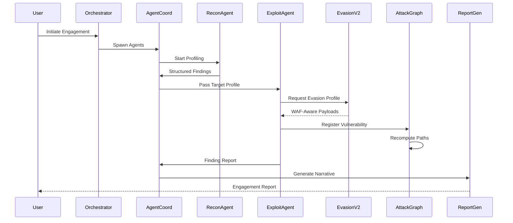

# Technical Design Document: Next-Gen Attack Engine

## Overview

This design document specifies the architecture and implementation plan for transforming the ATOMIC Framework v11.0 into a next-generation offensive security platform. The enhancements introduce seven major capability areas that build upon the existing scan orchestrator, AI engine, exploit chain engine, WAF evasion, LLM router, and attack map infrastructure.

The design follows a modular plugin architecture consistent with the existing codebase patterns, using Python dataclasses for models, async event-driven communication between subsystems, and a layered approach separating pure logic from I/O operations.

### Design Goals

- **Extensibility**: New attack modules, evasion techniques, and reporting formats plug in without modifying core infrastructure
- **Testability**: Pure logic components (graph algorithms, scoring, serialization) are separated from I/O for property-based testing
- **Backward Compatibility**: All existing 28+ modules continue to function unchanged; new subsystems integrate via the existing `AtomicEngine` interface
- **Performance**: Graph operations complete within specified time budgets; real-time collaboration synchronizes within 3 seconds
- **Resilience**: All subsystems gracefully degrade when dependencies are unavailable (LLM fallback, C2 handoff failure, etc.)


## Architecture

### High-Level System Architecture

```mermaid
graph TB
    subgraph "Control Plane"
        ORC[Attack Orchestrator]
        AC[Agent Coordinator]
        SL[Strategy Learner]
    end

    subgraph "AI Agent Layer"
        RA[Recon Agent]
        EA[Exploitation Agent]
        LMA[Lateral Movement Agent]
        RPA[Reporting Agent]
    end

    subgraph "Discovery Engine"
        DF[Differential Fuzzer]
        GF[Grammar Fuzzer]
        SA[State Analyzer]
        VG[Variant Generator]
    end

    subgraph "Evasion Engine V2"
        WF[WAF Fingerprinter]
        PM[Payload Metamorpher]
        TS[Traffic Shaper]
        PE[Protocol Evasion]
        TE[Temporal Distributor]
    end

    subgraph "Surface Intelligence"
        RM[Relationship Mapper]
        TF[Tech Fingerprinter]
        SI[Shadow IT Discovery]
        SR[Schema Reverser]
        CM[Continuous Monitor]
    end

    subgraph "Exploit Synthesis"
        ES[Exploit Synthesizer]
        SB[Shellcode Builder]
        PEsc[Privilege Escalator]
        GFi[Gadget Finder]
    end

    subgraph "Collaboration"
        CH[Collaboration Hub]
        FD[Finding Database]
        PB[Playbook Engine]
        RBAC[RBAC Manager]
    end

    subgraph "Reporting"
        RG[Report Generator]
        AGV[Attack Graph Viz]
        RQ[Risk Quantifier]
        RV[Remediation Validator]
    end

    subgraph "Infrastructure"
        LLM[LLM Router]
        DB[(SQLite/PostgreSQL)]
        WS[WebSocket Server]
        AG[Attack Graph Store]
    end

    ORC --> AC
    AC --> RA & EA & LMA & RPA
    ORC --> SL
    ORC --> DF & GF & SA & VG
    ORC --> WF & PM & TS & PE & TE
    ORC --> RM & TF & SI & SR & CM
    EA --> ES & SB & PEsc & GFi
    CH --> FD & PB & RBAC
    RPA --> RG & AGV & RQ & RV
    AC --> LLM
    FD --> DB
    CH --> WS
    RM --> AG
```




### Subsystem Interaction Flow



### Layered Architecture

The system follows a 4-layer architecture:

1. **Interface Layer**: CLI commands, Web Dashboard API, WebSocket real-time events
2. **Orchestration Layer**: Attack Orchestrator, Agent Coordinator, Playbook Engine
3. **Domain Layer**: Pure logic components (graph algorithms, scoring, serialization, metamorphism)
4. **Infrastructure Layer**: Database persistence, LLM providers, network I/O, file system

The Domain Layer contains all property-testable logic separated from side effects.


## Components and Interfaces

### 1. Attack Orchestrator (Control Plane)

**Module**: `core/attack_orchestrator.py`

Extends the existing `ScanOrchestrator` with multi-agent coordination and adaptive strategy.

```python
class AttackOrchestrator:
    """Autonomous multi-agent attack coordination."""
    
    def initiate_engagement(self, config: EngagementConfig) -> Engagement
    def spawn_agents(self, engagement: Engagement) -> List[AgentHandle]
    def adapt_strategy(self, feedback: ScanFeedback) -> StrategyUpdate
    def get_engagement_timeline(self, engagement_id: str) -> Timeline
```

**Interfaces**:
- `AgentCoordinator` — manages agent lifecycle, message passing, shared context
- `StrategyLearner` — persists and retrieves learned attack patterns
- `AttackGraph` — registers findings and computes exploitation paths

### 2. Agent Coordinator

**Module**: `core/agent_coordinator.py`

```python
class AgentCoordinator:
    """Manages specialized LLM agent communication and lifecycle."""
    
    def spawn_agent(self, role: AgentRole, context: SharedContext) -> AgentHandle
    def broadcast_finding(self, finding: Finding, source: AgentHandle) -> None
    def reassign_task(self, failed_agent: AgentHandle) -> AgentHandle
    def get_shared_context(self) -> SharedContext
```

### 3. Strategy Learner

**Module**: `core/strategy_learner.py`

```python
class StrategyLearner:
    """Persists and evolves attack strategies based on outcomes."""
    
    def record_success(self, vector: AttackVector, target_profile: TargetProfile) -> None
    def record_failure(self, vector: AttackVector, failure_ctx: FailureContext) -> None
    def rank_strategies(self, target_profile: TargetProfile) -> List[RankedStrategy]
    def prune_database(self, min_success_rate: float = 0.05, retain_recent: int = 100) -> int
```

### 4. Attack Graph Engine

**Module**: `core/attack_graph_engine.py`

Extends existing `AttackMapBuilder` with incremental graph computation and formal path analysis.

```python
class AttackGraphEngine:
    """Directed graph of vulnerabilities and exploitation paths."""
    
    def add_vulnerability(self, vuln: VulnNode) -> str  # returns node_id
    def add_edge(self, src: str, dst: str, confidence: float) -> None
    def compute_top_paths(self, k: int = 5) -> List[AttackPath]
    def incremental_update(self, new_node: str) -> List[AttackPath]
    def detect_cycles(self) -> List[List[str]]
    def export_json(self) -> dict
    def export_dot(self) -> str
```

### 5. Zero-Day Discovery Engine

**Module**: `core/zero_day_engine.py`

```python
class DifferentialFuzzer:
    """Detects logic flaws via response divergence analysis."""
    
    def generate_baseline(self, endpoint: Endpoint, valid_inputs: List[Input]) -> BaselineSet
    def fuzz_endpoint(self, endpoint: Endpoint, mutations: int = 50) -> List[Divergence]
    def classify_divergence(self, divergence: Divergence) -> LogicFlaw

class GrammarFuzzer:
    """Protocol-conformant malicious input generation."""
    
    def load_grammar(self, grammar: str, format: GrammarFormat) -> ParsedGrammar
    def generate_inputs(self, grammar: ParsedGrammar, count: int) -> List[FuzzInput]
    def minimize_crash(self, crash_input: FuzzInput) -> FuzzInput
    def serialize_findings(self, findings: List[CrashFinding], output_dir: str) -> None

class StateAnalyzer:
    """Application state machine inference and anomaly detection."""
    
    def observe_sequences(self, sequences: List[RequestSequence]) -> StateMachine
    def detect_bypasses(self, machine: StateMachine) -> List[StateBypass]
    def generate_sequence_diagram(self, bypass: StateBypass) -> str

class VariantGenerator:
    """Novel vulnerability variant production."""
    
    def generate_variants(self, pattern: VulnPattern, count: int = 10) -> List[Variant]
    def test_across_endpoints(self, vuln: ConfirmedVuln, endpoints: List[Endpoint]) -> List[VariantResult]
    def register_transformation(self, rule: TransformRule) -> None
```


### 6. Evasion Engine V2

**Module**: `core/evasion_v2.py`

Extends existing `WAFEvasionEngine` with ML-powered fingerprinting and polymorphic metamorphism.

```python
class WAFFingerprinter:
    """ML-based WAF product and version identification."""
    
    def fingerprint(self, responses: List[Response]) -> WAFProfile
    def get_bypass_techniques(self, profile: WAFProfile) -> List[BypassTechnique]

class PayloadMetamorpher:
    """Polymorphic payload transformation engine."""
    
    def metamorphose(self, payload: str, language: PayloadLang, count: int = 10) -> List[str]
    def analyze_block(self, payload: str, block_response: Response) -> BlockSignature
    def evade_signature(self, payload: str, signature: BlockSignature) -> List[str]

class TrafficShaper:
    """Legitimate traffic pattern mimicry."""
    
    def shape_request(self, request: Request, profile: TrafficProfile) -> TimedRequest
    def inject_noise(self, session: Session) -> List[NoiseRequest]
    def get_profile(self, aggressiveness: str) -> TrafficProfile  # stealth/normal/aggressive

class ProtocolEvasion:
    """Protocol-level ambiguity exploitation."""
    
    def smuggle_h2(self, payload: str) -> bytes
    def tunnel_websocket(self, payload: str) -> WebSocketFrame
    def chunk_fragment(self, payload: str, chunk_sizes: List[int]) -> bytes
    def dns_tunnel(self, data: bytes) -> List[DNSQuery]

class TemporalDistributor:
    """Time-distributed attack scheduling."""
    
    def create_schedule(self, requests: List[Request], window: TimeWindow) -> AttackSchedule
    def persist_schedule(self, schedule: AttackSchedule) -> None
    def resume_schedule(self) -> AttackSchedule
    def compile_results(self, schedule: AttackSchedule) -> FindingSet
```

### 7. Surface Intelligence

**Module**: `core/surface_intelligence.py`

Extends existing `build_target_surface` with relationship mapping and continuous monitoring.

```python
class RelationshipMapper:
    """Infrastructure relationship graph builder."""
    
    def enumerate_surface(self, domain: str) -> SurfaceGraph
    def add_asset(self, asset: Asset) -> None
    def identify_shared_infra(self) -> List[SharedInfraGroup]
    def export_graph(self) -> dict

class TechFingerprinter:
    """Version-level technology identification."""
    
    def fingerprint(self, target: str, responses: List[Response]) -> List[TechMatch]
    def query_cves(self, tech: TechMatch) -> List[CVE]

class SchemaReverser:
    """API schema inference from observed traffic."""
    
    def observe_request(self, request: Request, response: Response) -> None
    def generate_openapi(self) -> dict  # OpenAPI 3.0 spec
    def diff_against_official(self, official_spec: dict) -> List[UndocumentedEndpoint]

class ContinuousMonitor:
    """Attack surface change detection."""
    
    def configure(self, target: str, interval_hours: int) -> MonitorConfig
    def detect_changes(self, previous: SurfaceState, current: SurfaceState) -> List[SurfaceChange]
    def notify(self, changes: List[SurfaceChange], channels: List[NotifyChannel]) -> None
```

### 8. Exploit Synthesis

**Module**: `core/exploit_synthesis.py`

```python
class ExploitSynthesizer:
    """LLM-powered exploit code generation."""
    
    def generate_exploit(self, vuln: ConfirmedVuln) -> ExploitScript
    def validate_syntax(self, script: ExploitScript) -> ValidationResult
    def retry_on_failure(self, script: ExploitScript, error: str, max_retries: int = 3) -> ExploitScript

class ShellcodeBuilder:
    """Multi-stage environment-aware payload generation."""
    
    def detect_environment(self, recon_data: ReconData) -> TargetEnv
    def build_stage1(self, env: TargetEnv, max_size: int = 512) -> bytes
    def build_stage2(self, env: TargetEnv, payload_type: PayloadType) -> bytes
    def encode_shellcode(self, shellcode: bytes, bad_chars: bytes) -> bytes

class PrivilegeEscalator:
    """Privilege escalation path discovery."""
    
    def enumerate_access(self, session: Session) -> AccessLevel
    def find_escalation_paths(self, current: AccessLevel) -> List[EscalationPath]
    def rank_paths(self, paths: List[EscalationPath]) -> List[EscalationPath]

class GadgetFinder:
    """Deserialization gadget chain discovery."""
    
    def identify_format(self, endpoint: Endpoint) -> SerializationFormat
    def analyze_classes(self, classes: List[ClassInfo]) -> List[GadgetChain]
    def validate_chain(self, chain: GadgetChain, endpoint: Endpoint) -> bool
```


### 9. Collaboration Hub

**Module**: `core/collaboration.py`

```python
class CollaborationHub:
    """Multi-operator real-time engagement coordination."""
    
    def create_engagement(self, config: EngagementConfig) -> str  # engagement_id
    def join_engagement(self, engagement_id: str, operator: Operator) -> Session
    def broadcast_finding(self, finding: Finding, operator: Operator) -> None
    def detect_conflicts(self, targets: List[TargetClaim]) -> List[Conflict]
    def handoff_to_c2(self, session: ShellSession, c2_config: C2Config) -> HandoffResult

class FindingDatabase:
    """Shared finding storage with deduplication."""
    
    def submit_finding(self, finding: Finding) -> str  # finding_id or existing_id
    def deduplicate(self, finding: Finding) -> Optional[str]  # existing_id if duplicate
    def merge_evidence(self, existing_id: str, new_evidence: Evidence) -> None
    def search(self, query: str) -> List[Finding]
    def filter_findings(self, filters: FindingFilter) -> List[Finding]
    def export(self, format: ExportFormat) -> bytes  # JSON, CSV, or SARIF

class RBACManager:
    """Role-based access control for engagements."""
    
    def assign_role(self, operator: Operator, role: Role) -> None
    def check_permission(self, operator: Operator, action: Action) -> bool
    def get_role_permissions(self, role: Role) -> Set[Action]

class PlaybookEngine:
    """Reusable attack workflow management."""
    
    def define_playbook(self, definition: PlaybookDefinition) -> Playbook
    def execute_playbook(self, playbook: Playbook, context: EngagementContext) -> PlaybookExecution
    def serialize_yaml(self, playbook: Playbook) -> str
    def deserialize_yaml(self, yaml_str: str) -> Playbook
    def version_playbook(self, playbook: Playbook) -> VersionedPlaybook
```

### 10. Report Generator (Enhanced)

**Module**: `core/report_generator_v2.py`

Extends existing `ReportGenerator` with AI narratives and interactive visualization.

```python
class ReportGeneratorV2:
    """AI-powered comprehensive report generation."""
    
    def generate_report(self, engagement: Engagement) -> Report
    def generate_executive_summary(self, findings: List[Finding]) -> str
    def render_attack_graph(self, graph: AttackGraph) -> GraphVisualization
    def export(self, report: Report, format: ReportFormat) -> bytes  # PDF, HTML, Markdown

class RiskQuantifier:
    """Business impact scoring engine."""
    
    def compute_score(self, vuln: Finding, asset_weights: AssetWeights) -> float  # 0-100
    def compute_chain_score(self, chain: List[Finding]) -> float
    def map_to_level(self, score: float) -> RiskLevel
    def generate_heatmap(self, findings: List[Finding]) -> RiskHeatmap

class RemediationValidator:
    """Post-remediation validation engine."""
    
    def replay_exploit(self, finding: Finding) -> ValidationResult
    def test_variants(self, finding: Finding, count: int = 5) -> List[ValidationResult]
    def batch_validate(self, findings: List[Finding]) -> RemediationReport
    def generate_status_report(self, results: List[ValidationResult]) -> StatusReport
```


## Data Models

### Core Domain Models

```python
@dataclass
class EngagementConfig:
    """Configuration for an autonomous engagement."""
    target: str
    scope: List[str]  # allowed domains/IPs
    mode: str  # "autonomous", "guided", "playbook"
    time_budget: Optional[int]  # seconds
    evasion_profile: str  # "stealth", "normal", "aggressive"
    llm_profile: str  # "eco", "max", "mixed"
    temporal_window: Optional[TimeWindow]

@dataclass
class Engagement:
    """Active engagement state."""
    engagement_id: str
    config: EngagementConfig
    agents: List[AgentHandle]
    start_time: datetime
    status: EngagementStatus  # ACTIVE, PAUSED, COMPLETED, FAILED
    timeline: List[TimelineEvent]

@dataclass
class AgentHandle:
    """Reference to a running AI agent."""
    agent_id: str
    role: AgentRole  # RECON, EXPLOITATION, LATERAL_MOVEMENT, REPORTING
    status: AgentStatus  # RUNNING, IDLE, FAILED
    last_heartbeat: datetime

@dataclass
class SharedContext:
    """Shared state accessible to all agents in an engagement."""
    target_profile: TargetProfile
    findings: List[Finding]
    attack_graph: AttackGraph
    tech_stack: List[TechMatch]
    waf_profile: Optional[WAFProfile]
    active_sessions: List[ShellSession]
```

### Attack Graph Models

```python
@dataclass
class VulnNode:
    """Node in the attack graph representing a vulnerability."""
    node_id: str  # SHA-256 hash of (endpoint, vuln_type, parameter)
    vuln_type: str
    severity: float  # 0.0-10.0 CVSS-like
    exploitability: float  # 0.0-1.0
    access_level: str  # "anonymous", "authenticated", "admin", "system"
    endpoint: str
    parameter: Optional[str]
    metadata: Dict[str, Any]

@dataclass
class AttackEdge:
    """Directed edge representing causal relationship between vulnerabilities."""
    src_node: str
    dst_node: str
    confidence: float  # 0.0-1.0
    transition_type: str  # "enables", "requires", "amplifies"

@dataclass
class AttackPath:
    """Ordered sequence of nodes forming an exploitation path."""
    path_id: str
    nodes: List[str]  # node_ids in order
    edges: List[AttackEdge]
    combined_impact: float
    entry_point: str
    final_objective: str
    difficulty: float  # aggregate exploitation difficulty

@dataclass  
class AttackGraph:
    """Complete attack graph with nodes, edges, and computed paths."""
    nodes: Dict[str, VulnNode]
    edges: List[AttackEdge]
    paths: List[AttackPath]
    cycles: List[List[str]]
```

### Strategy and Learning Models

```python
@dataclass
class AttackVector:
    """Recorded attack attempt with full context."""
    vector_id: str
    vuln_type: str
    payload: str
    evasion_technique: Optional[str]
    target_tech: List[str]
    waf_type: Optional[str]

@dataclass
class RankedStrategy:
    """Strategy ranked by historical success rate."""
    vector: AttackVector
    success_rate: float  # 0.0-1.0
    sample_count: int
    target_profile_similarity: float  # 0.0-1.0

@dataclass
class TargetProfile:
    """Fingerprinted target characteristics for strategy matching."""
    technologies: List[TechMatch]
    waf: Optional[WAFProfile]
    hosting_provider: Optional[str]
    response_patterns: Dict[str, str]
```


### Evasion and Payload Models

```python
@dataclass
class WAFProfile:
    """Identified WAF product and characteristics."""
    product: str  # e.g., "Cloudflare", "AWS WAF"
    version: Optional[str]
    confidence: float  # 0.0-1.0
    blocked_patterns: List[str]
    bypass_techniques: List[BypassTechnique]

@dataclass
class PayloadLang(Enum):
    """Supported payload languages for metamorphism."""
    SQL = "sql"
    JAVASCRIPT = "javascript"
    SHELL = "shell"
    XML = "xml"
    TEMPLATE = "template"

@dataclass
class TrafficProfile:
    """Traffic shaping configuration."""
    avg_requests_per_second: float
    distribution: str  # "poisson", "uniform", "burst"
    inject_noise: bool
    maintain_session: bool
    referrer_chain: bool

@dataclass
class AttackSchedule:
    """Persisted temporal attack distribution plan."""
    schedule_id: str
    requests: List[ScheduledRequest]
    window_start: datetime
    window_end: datetime
    completed_indices: Set[int]
    status: str  # "active", "paused", "completed"
```

### Collaboration Models

```python
@dataclass
class Operator:
    """Authenticated engagement operator."""
    operator_id: str
    username: str
    role: Role  # LEAD, OPERATOR, OBSERVER, REPORTER

class Role(Enum):
    LEAD = "lead"
    OPERATOR = "operator"
    OBSERVER = "observer"
    REPORTER = "reporter"

@dataclass
class FindingFilter:
    """Query filter for the finding database."""
    severity: Optional[List[str]]
    vuln_type: Optional[List[str]]
    operator_id: Optional[str]
    endpoint: Optional[str]
    timestamp_after: Optional[datetime]
    timestamp_before: Optional[datetime]

@dataclass
class PlaybookDefinition:
    """Playbook structure for serialization."""
    name: str
    version: str
    description: str
    phases: List[PlaybookPhase]

@dataclass
class PlaybookPhase:
    """Single phase in a playbook."""
    phase_id: str
    name: str
    module_config: Dict[str, Any]
    conditions: List[BranchCondition]
    next_phase: Optional[str]
    alt_phase: Optional[str]  # branch if condition fails
    requires_human: bool
```

### Reporting Models

```python
@dataclass
class RiskLevel(Enum):
    CRITICAL = "critical"  # 80-100
    HIGH = "high"          # 60-79
    MEDIUM = "medium"      # 40-59
    LOW = "low"            # 20-39
    INFORMATIONAL = "informational"  # 0-19

@dataclass
class AssetWeights:
    """Per-engagement asset criticality configuration."""
    weights: Dict[str, float]  # asset_identifier -> weight (0.0-1.0)
    default_weight: float = 0.5

@dataclass
class RemediationReport:
    """Batch remediation validation results."""
    total_findings: int
    resolved: int
    unresolved: int
    resolution_percentage: float
    details: List[ValidationResult]
```


## Correctness Properties

*A property is a characteristic or behavior that should hold true across all valid executions of a system-essentially, a formal statement about what the system should do. Properties serve as the bridge between human-readable specifications and machine-verifiable correctness guarantees.*

### Property 1: Attack Graph JSON Round-Trip

*For any* valid AttackGraph containing nodes, edges, and computed paths, exporting to JSON and then reimporting should produce an equivalent AttackGraph with identical nodes, edges, and path structures.

**Validates: Requirements 3.5**

### Property 2: Attack Graph Top-K Path Optimality

*For any* AttackGraph with N paths, computing the top-K paths (K=5) should return paths sorted in descending order by combined_impact score, and no excluded path should have a higher combined_impact than any included path.

**Validates: Requirements 3.3**

### Property 3: Incremental Graph Update Equivalence

*For any* AttackGraph and any new VulnNode added to it, the paths returned by incremental_update should be equivalent to the paths that would be returned by a full recomputation of the entire graph.

**Validates: Requirements 3.4**

### Property 4: Cycle Detection Completeness

*For any* AttackGraph that contains at least one directed cycle, detect_cycles should return a non-empty list, and every cycle in the graph should be represented in the output.

**Validates: Requirements 3.6**


### Property 5: Strategy Ranking by Success Rate

*For any* set of learned strategies and a target profile, rank_strategies should return strategies sorted in descending order by historical success rate for matching target profiles, with higher-similarity profiles weighted more heavily.

**Validates: Requirements 2.3**

### Property 6: Strategy Pruning Invariants

*For any* strategy database with more than 10000 entries, after pruning: (a) no remaining strategy has a success rate below 5% unless it is among the 100 most recently added entries, and (b) at least the 100 most recent entries are always retained regardless of success rate.

**Validates: Requirements 2.5**

### Property 7: Unified Timeline Completeness

*For any* set of agent outputs in an engagement, the unified engagement timeline should contain every event from every agent, and events should be ordered chronologically.

**Validates: Requirements 1.6**

### Property 8: Payload Metamorphism Invariants

*For any* payload in a supported language (SQL, JavaScript, shell, XML, template), calling metamorphose should produce at least 10 variants that are: (a) all pairwise syntactically distinct, (b) all semantically equivalent to the original when executed by the target interpreter, and (c) different on each invocation.

**Validates: Requirements 11.1, 11.2, 11.3**

### Property 9: Playbook YAML Round-Trip

*For any* valid PlaybookDefinition, serializing to YAML then deserializing back should produce an equivalent PlaybookDefinition with identical phases, conditions, and branching logic.

**Validates: Requirements 28.7**

### Property 10: OpenAPI Schema Round-Trip

*For any* generated OpenAPI 3.0 schema, parsing then serializing then parsing again should produce an equivalent schema object with identical endpoints, methods, parameters, and response structures.

**Validates: Requirements 18.6**


### Property 11: Traffic Shaping Session Invariants

*For any* set of attack requests shaped with a traffic profile, the resulting session should satisfy: (a) inter-arrival times approximate a Poisson distribution matching the configured rate, (b) request ordering is non-sequential, (c) legitimate noise requests (CSS, images, JS) are interspersed between attack requests, and (d) all requests share consistent session cookies, referrer chains, and browser fingerprints.

**Validates: Requirements 12.1, 12.2, 12.3, 12.4**

### Property 12: Temporal Distribution Schedule Invariants

*For any* time window and set of requests, the generated schedule should satisfy: (a) all scheduled timestamps fall within [window_start, window_end], (b) inter-request intervals are not constant (jitter is present), and (c) any two requests targeting the same endpoint have at least the configured minimum interval between them.

**Validates: Requirements 14.1, 14.2, 14.3**

### Property 13: Finding Deduplication Idempotence

*For any* finding submitted to the FindingDatabase, submitting the same finding a second time (same endpoint, vulnerability type, and parameter) should not increase the total finding count, and should return the same finding_id as the first submission.

**Validates: Requirements 26.2**

### Property 14: Finding Evidence Merge Completeness

*For any* two findings that are duplicates, after merging, the resulting finding should contain all evidence items from both original submissions, and both operators should be recorded as contributors.

**Validates: Requirements 26.3**

### Property 15: Finding Filter Correctness

*For any* set of findings and any FindingFilter, all results returned by filter_findings should satisfy every predicate in the filter (severity, vuln_type, operator, endpoint, timestamp range).

**Validates: Requirements 26.5**

### Property 16: RBAC Permission Enforcement

*For any* operator with an assigned role and any action not included in that role's permission set, check_permission should return False. Conversely, for any action included in the role's permission set, check_permission should return True.

**Validates: Requirements 27.2, 27.5**


### Property 17: Risk Score Bounds and Level Mapping

*For any* vulnerability finding and any asset weight configuration, compute_score should always return a value in [0, 100], and map_to_level should map scores to levels following the exact thresholds: Critical 80-100, High 60-79, Medium 40-59, Low 20-39, Informational 0-19.

**Validates: Requirements 32.1, 32.4**

### Property 18: Chain Impact Score Exceeds Individual Scores

*For any* chain of two or more vulnerabilities, the computed chain impact score should be greater than or equal to the maximum individual vulnerability score in that chain.

**Validates: Requirements 32.3**

### Property 19: Remediation Report Arithmetic Correctness

*For any* batch validation result set, the resolution_percentage should equal (resolved / total_findings) * 100, and resolved + unresolved should equal total_findings.

**Validates: Requirements 33.5**

### Property 20: Grammar Fuzzer Output Validity

*For any* valid grammar definition (ABNF or PEG) loaded into the Grammar_Fuzzer, all generated inputs should be syntactically parseable by a reference parser for that grammar.

**Validates: Requirements 7.2**

### Property 21: Crash Input Minimization

*For any* crash-inducing input discovered by the Grammar_Fuzzer, the minimized form should be less than or equal to the original input in size and should still trigger the same crash behavior when replayed.

**Validates: Requirements 7.5**

### Property 22: Variant Generator Distinctness

*For any* known vulnerability pattern provided to the Variant_Generator, the output should contain at least 10 variants that are pairwise syntactically distinct from each other and from the original pattern.

**Validates: Requirements 9.1**

### Property 23: State Bypass Detection

*For any* inferred state machine with a defined required intermediate state on a path, if an observed transition sequence skips that required intermediate state, the State_Analyzer should flag it as a state-bypass vulnerability.

**Validates: Requirements 8.2**

### Property 24: Divergence Detection and Recording

*For any* pair of semantically equivalent inputs that produce different authorization outcomes, the Differential_Fuzzer should flag the discrepancy and the recorded result should contain the exact input pair, response pair, and divergence type.

**Validates: Requirements 6.2, 6.4**

### Property 25: Surface Change Detection Accuracy

*For any* two SurfaceState snapshots, the detected changes should be exactly the symmetric difference between the two states — every added, removed, or modified asset should appear in the change list, and no unchanged asset should appear.

**Validates: Requirements 19.2**

### Property 26: Temporal Results Compilation Completeness

*For any* set of completed distributed request results within a temporal schedule, the compiled finding set should contain the union of all individual request findings with no findings lost.

**Validates: Requirements 14.5**

### Property 27: Shellcode Bad Character Avoidance

*For any* shellcode and configurable set of bad characters, the encoded output should not contain any byte from the bad character set.

**Validates: Requirements 21.5**


## Error Handling

### Error Handling Strategy

The system implements a layered error handling approach with graceful degradation:

#### Agent Failures (Requirements 1.5, 4.5)
- **Detection**: Heartbeat monitoring with 30-second timeout
- **Recovery**: Automatic task reassignment to new agent instance
- **Fallback**: LLM unavailability triggers static payload selection system
- **Logging**: All failures logged with context for post-engagement analysis

#### Network Failures (Requirements 6.5, 13.6)
- **Target Unresponsive**: Pause-and-retry with reduced concurrency (10s pause for fuzzing)
- **Protocol Evasion Failures**: Priority-chain fallback to next available technique
- **Rate Limiting (HTTP 429)**: Exponential backoff with threshold detection

#### External Service Failures (Requirements 29.5, 20.5)
- **C2 Framework Unreachable**: Maintain existing access, report handoff failure to operator
- **Exploit Generation Failure**: Maximum 3 retry attempts with failure analysis between retries
- **LLM Provider Timeout**: Circuit breaker pattern with fallback to cached/static responses

#### Data Integrity (Requirements 14.4, 25.6)
- **Schedule Persistence**: Temporal attack schedules written to durable storage with write-ahead log
- **Session Resumption**: Disconnected operator sessions preserved for 24 hours
- **Database Pruning Safety**: Always retain minimum 100 recent entries regardless of prune criteria

#### Scan Safety (Requirements 22.6, 21.6)
- **Privilege Escalation Failure**: Log failure, attempt next ranked path without disrupting current access
- **Stage-1 Callback Timeout**: 30-second timeout, retry with alternative delivery mechanism
- **Graph Cycles**: Detected and flagged rather than causing infinite traversal

### Error Classification

| Error Type | Severity | Response | Recovery |
|---|---|---|---|
| Agent timeout | Warning | Reassign task | Automatic |
| LLM unavailable | Warning | Use static fallback | Automatic |
| Target unresponsive | Info | Pause/retry | Automatic |
| Rate limited | Info | Backoff | Automatic |
| C2 handoff failure | Error | Maintain access | Manual intervention |
| Database corruption | Critical | Halt engagement | Manual recovery |
| Graph cycle detected | Warning | Flag and skip | Automatic |
| Exploit syntax error | Warning | Retry generation | Automatic (max 3) |


## Testing Strategy

### Overview

The testing strategy employs a dual approach combining property-based testing (PBT) for universal invariants and example-based testing for specific scenarios, edge cases, and integration points.

### Property-Based Testing

**Library**: [Hypothesis](https://hypothesis.readthedocs.io/) (Python)

**Configuration**:
- Minimum 100 iterations per property test
- Each property test tagged with: `Feature: next-gen-attack-engine, Property {N}: {title}`
- Custom generators for domain-specific types (VulnNode, AttackGraph, Playbook, etc.)

**PBT Coverage Areas**:

| Property | Component | Pattern |
|---|---|---|
| 1 | AttackGraphEngine | Round-trip (JSON export/import) |
| 2 | AttackGraphEngine | Sorting/optimality (top-K paths) |
| 3 | AttackGraphEngine | Equivalence (incremental vs full) |
| 4 | AttackGraphEngine | Invariant detection (cycles) |
| 5 | StrategyLearner | Sorting (success rate ranking) |
| 6 | StrategyLearner | Invariant (pruning constraints) |
| 7 | AttackOrchestrator | Completeness (timeline aggregation) |
| 8 | PayloadMetamorpher | Equivalence + uniqueness |
| 9 | PlaybookEngine | Round-trip (YAML serialization) |
| 10 | SchemaReverser | Round-trip (OpenAPI) |
| 11 | TrafficShaper | Statistical + invariants |
| 12 | TemporalDistributor | Bounds + invariants |
| 13 | FindingDatabase | Idempotence (deduplication) |
| 14 | FindingDatabase | Completeness (evidence merge) |
| 15 | FindingDatabase | Invariant (filter correctness) |
| 16 | RBACManager | Classification (permission logic) |
| 17 | RiskQuantifier | Bounds + mapping |
| 18 | RiskQuantifier | Metamorphic (chain scoring) |
| 19 | RemediationValidator | Mathematical (percentage) |
| 20 | GrammarFuzzer | Invariant (output validity) |
| 21 | GrammarFuzzer | Metamorphic (minimization) |
| 22 | VariantGenerator | Invariant (distinctness) |
| 23 | StateAnalyzer | Classification (bypass detection) |
| 24 | DifferentialFuzzer | Classification + recording |
| 25 | ContinuousMonitor | Equivalence (change detection) |
| 26 | TemporalDistributor | Completeness (results) |
| 27 | ShellcodeBuilder | Invariant (bad char avoidance) |

### Example-Based Unit Tests

Focus areas for example-based tests:
- Agent spawning verification (Req 1.1)
- Failure recovery scenarios (Req 1.5, 4.5, 5.1, 5.2)
- Recording behavior (Req 2.1, 2.2)
- Specific protocol evasion techniques (Req 13.1-13.6)
- C2 handoff scenarios (Req 29.1-29.5)
- Report format generation (Req 30.5)

### Integration Tests

Focus areas for integration tests:
- LLM provider communication and fallback (Req 4.1, 20.1)
- Database persistence across restarts (Req 2.4, 14.4)
- WebSocket real-time synchronization (Req 25.2-25.4)
- Network enumeration with mocked DNS/CT (Req 15.1, 17.1)
- Cloud metadata endpoint interaction (Req 23.2)
- WAF fingerprinting accuracy against labeled dataset (Req 10.1)

### Smoke Tests

- Grammar support for all 5 protocols (Req 7.4)
- WAF knowledge base contains 20+ products (Req 10.4)
- Payload metamorpher supports all 5 languages (Req 11.4)
- State analyzer models auth/session/transaction (Req 8.3)
- Variant registry contains CVE mappings (Req 9.5)

### Test Infrastructure

- **Generators**: Custom Hypothesis strategies for `VulnNode`, `AttackGraph`, `PlaybookDefinition`, `Finding`, `WAFProfile`, `TrafficProfile`, `TimeWindow`
- **Mocks**: LLM responses, network requests, cloud APIs, C2 frameworks
- **Fixtures**: Pre-built attack graphs, grammar definitions, strategy databases
- **CI Integration**: All property tests run in CI with `--hypothesis-seed` for reproducibility
