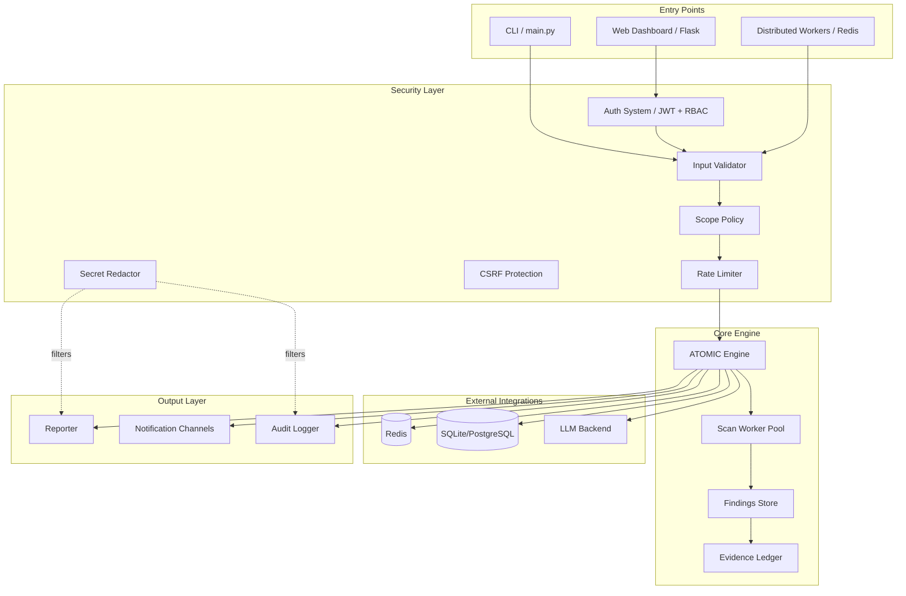

# Technical Design: Security Hardening Review

## Overview

This design specifies the comprehensive security hardening and production-readiness improvements for the ATOMIC Framework v11.0 ("TITAN"). The framework is a Python-based web vulnerability scanner comprising 84+ core modules, 30+ attack modules, a Flask + Socket.IO web dashboard (91 API endpoints), distributed scanning via Redis, local/cloud LLM integration, and Burp Suite-style tooling.

The hardening effort covers 15 requirement areas spanning secrets management, input validation, concurrency safety, error handling, performance, architecture, observability, network security, container security, testing, scope enforcement, supply chain, web authentication, data protection, and LLM integration security.

### Design Principles

1. **Defense in Depth**: Multiple overlapping security controls at each layer
2. **Fail Secure**: Default to the most restrictive behavior; require explicit opt-in for dangerous operations
3. **Least Privilege**: Components only have access to the resources they need
4. **Auditability**: All security-relevant actions produce structured, tamper-evident logs
5. **Backward Compatibility**: Existing CLI/API contracts are preserved; hardening changes are additive or guarded by feature flags

### Key Design Decisions

| Decision | Rationale |
|----------|-----------|
| Use `cryptography` library (Fernet/AES-256-GCM) for encryption at rest | Well-audited, actively maintained, already a transitive dependency of `requests` |
| Implement a `SecretRedactor` middleware as a logging filter | Centralizes redaction logic; applies to all loggers without per-module changes |
| Use `threading.Lock` over `asyncio.Lock` for concurrency | The engine is primarily threaded (`ThreadPoolExecutor`); no event loop available in scan workers |
| Adopt JSON Schema for config validation | Machine-readable, supports composable schemas, tooling exists in Python (`jsonschema`) |
| Use `argon2-cffi` for password hashing with PBKDF2-SHA256 fallback | Argon2id is memory-hard (resists GPU attacks); PBKDF2 provides fallback when C extension unavailable |

---

## Architecture

### High-Level Security Architecture



### Security Boundaries

1. **Trust Boundary 1 — User Input**: All CLI args, HTTP request bodies, config files, and target file entries are untrusted
2. **Trust Boundary 2 — Network**: All outbound connections (targets, Redis, LLM APIs) traverse untrusted networks
3. **Trust Boundary 3 — Plugin Boundary**: Third-party plugins execute in a restricted sandbox
4. **Trust Boundary 4 — LLM Output**: All LLM responses are untrusted and must be validated before use

---

## Components and Interfaces

### 1. SecretRedactor (core/secret_redactor.py)

**Purpose**: Centralized secret detection and redaction for logs, error messages, and reports.

```python
class SecretRedactor:
    """Logging filter and utility that redacts secrets from text."""
    
    def __init__(self, patterns: List[Tuple[str, re.Pattern]] = None):
        """Initialize with SECRET_PATTERNS from config.py."""
    
    def redact(self, text: str) -> str:
        """Replace all matches with [REDACTED:{pattern_name}]."""
    
    def filter(self, record: logging.LogRecord) -> bool:
        """logging.Filter implementation that redacts record.msg and args."""

class SecretValidator:
    """Validates config files for embedded plaintext secrets."""
    
    def scan_config(self, config_dict: dict) -> List[SecretViolation]:
        """Return list of keys containing plaintext secrets."""
```

### 2. InputValidator (core/input_validator.py)

**Purpose**: Centralized input validation for URLs, scan IDs, commands, file paths, and Content-Type.

```python
class InputValidator:
    """Validates and sanitizes all user-supplied input."""
    
    ALLOWED_SCHEMES = {"http", "https"}
    SCAN_ID_PATTERN = re.compile(r"^[a-f0-9]{8}$")
    MAX_TARGET_FILE_ENTRIES = 10_000
    MAX_LINE_LENGTH = 2048
    SHELL_METACHARACTERS = set(";|`$()&\n\r")
    
    def validate_target_url(self, url: str, allow_internal: bool = False) -> ValidationResult:
        """Validate URL scheme, reject credentials, check routability."""
    
    def validate_scan_id(self, scan_id: str) -> bool:
        """Validate hex UUID prefix format (8 hex chars)."""
    
    def validate_shell_command(self, command: str) -> ValidationResult:
        """Check command against character allowlist."""
    
    def validate_target_file(self, filepath: str) -> List[str]:
        """Parse and validate target file (max entries, URL format, line length)."""
    
    def validate_content_type(self, request, expected: str) -> bool:
        """Verify Content-Type header matches expected value."""
```

### 3. ConcurrencyGuard (core/concurrency.py)

**Purpose**: Thread-safe wrappers for shared mutable state.

```python
class ThreadSafeFindingsList:
    """Thread-safe findings list with deduplication invariant."""
    
    def __init__(self):
        self._lock = threading.Lock()
        self._findings: List[Finding] = []
        self._seen: Set[Tuple] = set()  # dedup keys
    
    def add_finding(self, finding: Finding) -> bool:
        """Add finding atomically; returns False if duplicate."""
    
    def get_all(self) -> List[Finding]:
        """Return copy of findings list."""

class AtomicTokenBucket:
    """Thread-safe token bucket rate limiter."""
    
    def __init__(self, rate: float, burst_multiplier: float = 2.0):
        self._lock = threading.Lock()
    
    def acquire(self, tokens: int = 1) -> bool:
        """Try to consume tokens; returns False if rate exceeded."""

class AtomicEvidenceLedger:
    """Thread-safe HMAC-chain evidence ledger."""
    
    def append(self, entry: dict) -> int:
        """Append entry with sequence number and HMAC chain verification."""
```

### 4. Enhanced Auth System (core/auth.py modifications)

**Purpose**: Hardened JWT authentication with account lockout, session timeout, and strong password hashing.

```python
# New constants
PASSWORD_MIN_LENGTH = 12  # upgraded from 8
PBKDF2_ITERATIONS = 600_000
LOCKOUT_THRESHOLD = 5
LOCKOUT_WINDOW_SECONDS = 900  # 15 minutes
LOCKOUT_DURATION_SECONDS = 1800  # 30 minutes
INACTIVITY_TIMEOUT_SECONDS = 1800  # 30 minutes
MAX_ACCESS_TOKEN_EXPIRY = 3600  # 1 hour
MAX_REFRESH_TOKEN_EXPIRY = 86400  # 24 hours

class EnhancedAuthSystem:
    """Hardened authentication with lockout, session timeout, Argon2id."""
    
    def hash_password(self, password: str) -> str:
        """Hash with Argon2id (preferred) or PBKDF2-SHA256 (fallback)."""
    
    def verify_password(self, password: str, hash: str) -> bool:
        """Verify password against stored hash."""
    
    def check_lockout(self, username: str) -> bool:
        """Return True if account is locked out."""
    
    def record_failed_attempt(self, username: str) -> None:
        """Track failed login for lockout logic."""
    
    def issue_token(self, user: User) -> TokenPair:
        """Issue JWT with iat claim and enforced max expiry."""
    
    def validate_session_activity(self, token: str) -> bool:
        """Check inactivity timeout (30 min sliding window)."""
    
    def refuse_insecure_start(self) -> None:
        """Refuse to start dashboard in production without ATOMIC_AUTH_SECRET."""
```

### 5. ResourceManager (core/resource_manager.py)

**Purpose**: Memory limits, connection pooling, and graceful degradation.

```python
class ResourceManager:
    """Monitors and manages system resources during scanning."""
    
    def __init__(self, memory_limit_mb: int = 2048):
        self._memory_limit = memory_limit_mb
        self._degradation_threshold = 0.8
    
    def check_memory(self) -> ResourceStatus:
        """Check current memory usage; trigger degradation if needed."""
    
    def degrade_gracefully(self) -> None:
        """Reduce thread count, flush caches when memory is high."""
    
    def get_connection_pool(self, host: str) -> ConnectionPool:
        """Return pooled HTTP connections for a given host."""
```

### 6. PluginSandbox (core/plugin_sandbox.py)

**Purpose**: Restricted execution environment for third-party plugins.

```python
class PluginSandbox:
    """Validates and sandboxes plugin execution."""
    
    ALLOWED_IMPORTS = {"os.path", "re", "json", "hashlib", "urllib.parse", ...}
    
    def validate_plugin(self, path: str) -> ValidationResult:
        """Check file signature, permitted base classes, disallowed imports."""
    
    def execute_sandboxed(self, plugin, method: str, *args) -> Any:
        """Run plugin method with restricted globals and timeout."""
```

### 7. LLMSecurityGateway (core/llm_security.py)

**Purpose**: Sanitize prompts sent to LLM, validate/sanitize responses.

```python
class LLMSecurityGateway:
    """Security gateway for all LLM interactions."""
    
    MAX_PROMPT_TOKENS = 8192
    INJECTION_PATTERNS = [...]  # patterns for prompt injection detection
    
    def sanitize_prompt(self, prompt: str, allow_target_data: bool = False) -> str:
        """Strip target-specific info (URLs, IPs, creds) unless allowed."""
    
    def validate_response(self, response: str) -> SanitizedResponse:
        """Check for injection patterns, sanitize code blocks."""
    
    def truncate_to_limit(self, text: str) -> str:
        """Enforce max token limit on prompt data."""
    
    def audit_interaction(self, prompt: str, response: str, metadata: dict) -> None:
        """Log interaction to LLM audit log when --llm-audit enabled."""
```

### 8. NetworkHardening (applied across Requester and Web Dashboard)

**Purpose**: TLS verification defaults, security headers, CSRF protection.

```python
class SecureRequester:
    """HTTP client with TLS verification by default."""
    
    def __init__(self, verify_tls: bool = True, pool_size: int = None):
        """Default to TLS verification; only disable with explicit flag."""
    
    def request(self, method: str, url: str, **kwargs) -> Response:
        """Make request with connection pooling and TLS enforcement."""

# Flask middleware
class SecurityHeadersMiddleware:
    """Adds security headers to all Flask responses."""
    
    HEADERS = {
        "Strict-Transport-Security": "max-age=31536000; includeSubDomains",
        "X-Content-Type-Options": "nosniff",
        "X-Frame-Options": "DENY",
        "Content-Security-Policy": "default-src 'self'",
        "Referrer-Policy": "strict-origin-when-cross-origin",
    }

class CSRFProtection:
    """Double-submit cookie CSRF protection for state-changing endpoints."""
    
    def generate_token(self) -> str:
        """Generate cryptographically random CSRF token."""
    
    def validate_request(self, request) -> bool:
        """Validate CSRF token on POST/PUT/DELETE requests."""
```

### 9. DockerHardening (Dockerfile and docker-compose.yml changes)

Changes to Dockerfile:
- Pin base image with SHA256 digest
- Multi-stage build (build deps separate from runtime)
- Run as non-root with `--cap-drop=ALL`
- Add HEALTHCHECK instruction
- Write mutable data to designated volume path

Changes to docker-compose.yml:
- Bind to 127.0.0.1 instead of 0.0.0.0
- Read secrets from environment/mounted files only

### 10. DataProtection (core/data_protection.py)

**Purpose**: Encryption at rest, redaction in reports, data retention policies.

```python
class DataProtection:
    """Handles encryption at rest and data lifecycle management."""
    
    def encrypt_field(self, plaintext: str) -> str:
        """Encrypt with AES-256-GCM using ATOMIC_ENCRYPTION_KEY."""
    
    def decrypt_field(self, ciphertext: str) -> str:
        """Decrypt AES-256-GCM encrypted field."""
    
    def redact_sensitive_patterns(self, text: str) -> str:
        """Mask credit cards, SSNs, API keys in report output."""
    
    def purge_scan(self, scan_id: str) -> PurgeResult:
        """Securely delete all data for a scan ID."""
    
    def enforce_retention(self, retention_days: int) -> int:
        """Purge data older than retention period; return count deleted."""
```

---

## Data Models

### Finding (Enhanced)

```python
@dataclass
class Finding:
    technique: str = ""
    url: str = ""
    method: str = "GET"
    param: str = ""
    payload: str = ""
    evidence: str = ""
    severity: str = "INFO"
    confidence: float = 0.0
    mitre_id: str = ""
    cwe_id: str = ""
    cvss: float = 0.0
    extracted_data: str = ""  # encrypted at rest when contains sensitive data
    signals: dict = field(default_factory=dict)
    priority: float = 0.0
    remediation: str = ""
    # ... existing exploit fields ...
    
    # New: encryption metadata
    _encrypted_fields: List[str] = field(default_factory=list)
```

### SecurityEvent (new)

```python
@dataclass
class SecurityEvent:
    """Structured security event for audit logging."""
    event_type: str  # "auth_failure", "scope_violation", "injection_attempt", etc.
    timestamp: str  # ISO 8601 UTC
    scan_id: Optional[str] = None
    username: Optional[str] = None
    source_ip: Optional[str] = None
    target_resource: Optional[str] = None
    details: dict = field(default_factory=dict)
    severity: str = "WARNING"
    correlation_id: str = field(default_factory=lambda: uuid.uuid4().hex[:16])
```

### ConfigSchema (new)

```python
CONFIG_SCHEMA = {
    "type": "object",
    "properties": {
        "target": {"type": "string", "format": "uri"},
        "threads": {"type": "integer", "minimum": 1, "maximum": 200},
        "timeout": {"type": "integer", "minimum": 1, "maximum": 300},
        "rate_limit": {"type": "number", "minimum": 0},
        "evasion": {"type": "string", "enum": ["none", "low", "medium", "high", "insane", "stealth"]},
        # ... full schema for all config options
    },
    "additionalProperties": False
}
```

### LockoutRecord (new)

```python
@dataclass
class LockoutRecord:
    username: str
    failed_attempts: int = 0
    first_failure_time: float = 0.0
    locked_until: float = 0.0
    
    @property
    def is_locked(self) -> bool:
        return time.time() < self.locked_until
```

---

## Correctness Properties

*A property is a characteristic or behavior that should hold true across all valid executions of a system — essentially, a formal statement about what the system should do. Properties serve as the bridge between human-readable specifications and machine-verifiable correctness guarantees.*

### Property 1: Secret redaction completeness

*For any* string containing a pattern matching any entry in SECRET_PATTERNS, passing it through `SecretRedactor.redact()` SHALL produce a string that no longer matches any SECRET_PATTERN entry.

**Validates: Requirements 1.2, 1.5**

### Property 2: Input validation rejects unsafe URLs

*For any* URL string that has a scheme not in {http, https}, or contains embedded credentials (user:pass@host), or resolves to a non-routable/link-local address, `InputValidator.validate_target_url()` SHALL return a failure result.

**Validates: Requirements 2.1**

### Property 3: YAML safe_load prevents code execution

*For any* YAML document containing Python-specific constructor tags (!!python/object, !!python/exec, etc.), `Config_Loader` SHALL reject the document without executing any constructor code.

**Validates: Requirements 2.2**

### Property 4: Shell command validation rejects metacharacters

*For any* string containing at least one shell metacharacter (from the set {`;`, `|`, `` ` ``, `$(`, `&`, `\n`, `\r`}), `InputValidator.validate_shell_command()` SHALL reject the command.

**Validates: Requirements 2.3**

### Property 5: HTML report escaping prevents XSS

*For any* finding payload or evidence string containing HTML-significant characters (`<`, `>`, `"`, `'`, `&`), the Reporter's HTML output SHALL contain only the HTML-entity-encoded equivalents, never the raw characters in an executable context.

**Validates: Requirements 2.4**

### Property 6: Scan ID validation is strict

*For any* string that does not match the pattern `^[a-f0-9]{8}$`, `InputValidator.validate_scan_id()` SHALL return False.

**Validates: Requirements 2.5**

### Property 7: Concurrent finding addition preserves deduplication

*For any* set of N findings submitted concurrently to `ThreadSafeFindingsList.add_finding()`, the resulting list SHALL contain no two findings with identical (technique, url, param, payload) tuples, regardless of submission order or timing.

**Validates: Requirements 3.1**

### Property 8: Rate limiter token bucket atomicity

*For any* sequence of concurrent `acquire()` calls on `AtomicTokenBucket`, the total tokens consumed SHALL never exceed the configured rate × elapsed time + burst allowance (2x rate), regardless of thread interleaving.

**Validates: Requirements 3.2**

### Property 9: Evidence ledger HMAC chain integrity

*For any* sequence of N append operations to `AtomicEvidenceLedger`, entry[i].hmac SHALL equal HMAC(key, entry[i-1].hmac || entry[i].data) for all i > 0, and sequence numbers SHALL be strictly monotonically increasing with no gaps.

**Validates: Requirements 3.7, 7.3**

### Property 10: Error handler never leaks internals

*For any* unhandled exception raised in a Web Dashboard API route, the HTTP response body SHALL NOT contain file paths, stack traces, variable names, or internal state. The response SHALL contain only a generic message and a correlation ID.

**Validates: Requirements 4.2**

### Property 11: Exponential backoff bounds

*For any* sequence of retry attempts after connection failure, the delay between attempt N-1 and attempt N SHALL be at least min(2^(N-1), 60) seconds and at most min(2^N, 60) seconds (with jitter), never exceeding the 60-second maximum.

**Validates: Requirements 4.3, 4.4**

### Property 12: Memory limit enforcement

*For any* scan execution, when memory usage exceeds 80% of the configured limit (default 2GB), the ResourceManager SHALL reduce active thread count and the findings list length SHALL not exceed 10000 in-memory entries.

**Validates: Requirements 5.1, 5.4**

### Property 13: Pagination bounds enforcement

*For any* request to a list endpoint with page_size parameter, the response SHALL contain at most min(page_size, 500) items and at least 0 items, regardless of the requested page_size value.

**Validates: Requirements 5.5**

### Property 14: Structured log format validity

*For any* scan lifecycle event emitted by the engine (start, phase transition, finding, error, completion), the log record SHALL be valid JSON containing at minimum: scan_id (string), timestamp (ISO 8601 UTC), severity (string), and event_type (string).

**Validates: Requirements 7.1**

### Property 15: Security headers on all responses

*For any* HTTP response from the Web Dashboard, the response headers SHALL include all five required security headers (Strict-Transport-Security, X-Content-Type-Options, X-Frame-Options, Content-Security-Policy, Referrer-Policy) with the specified values.

**Validates: Requirements 8.3**

### Property 16: CSRF token validation on state-changing requests

*For any* POST, PUT, or DELETE request to the Web Dashboard that does not include a valid CSRF token, the response SHALL be HTTP 403 Forbidden.

**Validates: Requirements 8.6**

### Property 17: Password hash strength

*For any* password processed by `EnhancedAuthSystem.hash_password()`, the resulting hash SHALL use either Argon2id or PBKDF2-SHA256 with at least 600,000 iterations, and `verify_password(wrong_password, hash)` SHALL return False for any string not equal to the original password.

**Validates: Requirements 13.6**

### Property 18: Account lockout enforcement

*For any* account with 5 consecutive failed authentication attempts within a 15-minute window, subsequent authentication attempts SHALL be rejected (even with correct credentials) until either 30 minutes have elapsed or an administrator unlocks the account.

**Validates: Requirements 13.2**

### Property 19: Data encryption at rest round-trip

*For any* plaintext string, `DataProtection.encrypt_field(plaintext)` followed by `DataProtection.decrypt_field(ciphertext)` SHALL produce a string equal to the original plaintext.

**Validates: Requirements 14.1**

### Property 20: LLM prompt sanitization strips target data

*For any* prompt containing URLs, IP addresses, or credential patterns, `LLMSecurityGateway.sanitize_prompt(prompt, allow_target_data=False)` SHALL produce a prompt that contains none of the original URLs, IP addresses, or credential values.

**Validates: Requirements 15.1**

### Property 21: LLM prompt size enforcement

*For any* input text exceeding the MAX_PROMPT_TOKENS limit (8192 tokens), `LLMSecurityGateway.truncate_to_limit()` SHALL produce output that is at most MAX_PROMPT_TOKENS tokens long while preserving a meaningful prefix of the content.

**Validates: Requirements 15.2**

### Property 22: Scope enforcement rejects out-of-scope URLs

*For any* URL whose domain is not in the allowed_domains list when --strict-scope is enabled, `Scope_Policy` SHALL reject the URL and the URL SHALL NOT be scanned, regardless of how it was discovered.

**Validates: Requirements 11.2**

---

## Error Handling

### Error Handling Strategy

| Layer | Strategy | Example |
|-------|----------|---------|
| Scan Modules | Catch all exceptions, log with context, continue | Module raises `TimeoutError` → log, increment error counter, skip endpoint |
| Web Dashboard | Return generic 500 + correlation ID | Python `KeyError` → `{"error": "Internal error", "id": "abc123"}` |
| Redis/Distributed | Buffer locally, exponential backoff reconnect | Connection lost → buffer findings, retry at 1s, 2s, 4s... 60s max |
| LLM Backend | Retry transient, degrade gracefully | Rate limit → retry 3x; auth error → log, continue without LLM |
| Config Loading | Report exact error and exit | Malformed YAML → print line/char position, exit code 1 |
| Graceful Shutdown | SIGTERM/SIGINT → flush findings, partial report | Signal received → cancel pending, save state, exit non-zero |

### Error Response Format (Web Dashboard)

```json
{
  "error": "An internal error occurred",
  "correlation_id": "a1b2c3d4e5f6",
  "status": 500
}
```

### Structured Error Logging Format

```json
{
  "timestamp": "2024-01-15T10:30:00Z",
  "level": "ERROR",
  "scan_id": "abcdef12",
  "module": "sqli",
  "target_url": "https://target.com/api/search",
  "phase": "exploitation",
  "error_type": "TimeoutError",
  "message": "Request timed out after 15s",
  "correlation_id": "a1b2c3d4e5f6"
}
```

---

## Testing Strategy

### Testing Approach

This security hardening applies to core logic modules (input validation, cryptography, concurrency, authentication) that are well-suited to property-based testing, alongside integration tests for infrastructure concerns.

### Property-Based Testing

**Library**: [Hypothesis](https://hypothesis.readthedocs.io/) (Python PBT library)

**Configuration**: Minimum 100 examples per property test

**Tag format**: `# Feature: security-hardening-review, Property {N}: {title}`

Property tests will cover:
- Secret redaction completeness (Property 1)
- URL validation rejection of unsafe inputs (Property 2)
- YAML safe_load security (Property 3)
- Shell metacharacter rejection (Property 4)
- HTML escaping correctness (Property 5)
- Scan ID format validation (Property 6)
- Concurrent deduplication invariant (Property 7)
- Token bucket rate bounds (Property 8)
- HMAC chain integrity (Property 9)
- Error response sanitization (Property 10)
- Exponential backoff bounds (Property 11)
- Pagination bounds (Property 13)
- Log format validity (Property 14)
- Security headers presence (Property 15)
- Password hash correctness (Property 17)
- Account lockout enforcement (Property 18)
- Encryption round-trip (Property 19)
- LLM prompt sanitization (Property 20)
- LLM token truncation (Property 21)
- Scope enforcement (Property 22)

### Unit Tests (Example-Based)

- Config file secret detection (specific patterns)
- JWT token expiry enforcement (specific timeouts)
- CSRF token validation (valid/invalid/missing cases)
- Docker healthcheck endpoint (specific response format)
- Graceful shutdown signal handling (specific signal sequences)
- Redis TLS rejection when TLS required (specific connection scenarios)

### Integration Tests

- End-to-end scan pipeline with hardened components
- Web dashboard authentication flow (login → token → refresh → expire)
- Distributed worker task consumption (exactly-once delivery)
- Report generation with redaction enabled
- LLM interaction audit logging

### Security Testing

- Bandit scanning at HIGH threshold (CI gate)
- pip-audit dependency vulnerability scanning (CI gate)
- Type checking with mypy --strict on new files
- Coverage threshold: 70% minimum on core/ and modules/
